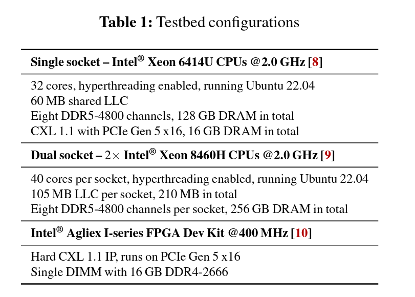

# Demystifying CXL Memory with Genuine CXL-Ready Systems and Devices

## Key Takeaway

---

## Background

- CXL can be the potential solution to growing demand for memory capacity
- Current lack of commercial hardware supporting CXL; Emerging `Intel Sapphire Rapids CPU` and `Intel Agilex-I FPGA based CXL memory`

## Major Controbutions

Observations:

- CXL behaves differently from remote NUMA node
  - higher latency
  - fewer memory channels
  - different transfer efficiency

- Real applications have different sensitivity to CXL memory offloading
  - µs-latency database is highly sensitive
  - ms-latency microservices are less affected
  - memory-intensive ML inference is sensitive to the random access throughput offered by CXL memory
  - In all cases, interleaving memory
 across the CPU-attached DRAMs and CXL memory reduces the performance penalty introduced by CXL memory.

- practical guidelines for CXL memory
  - evenly distribute the bandwidth across CXL memory and DRAM
  - use cache-bypassing instructions for data movement from/to CXL memory
  - limit the number of write threads to CXL memory

## Design

### Experiment Setup

