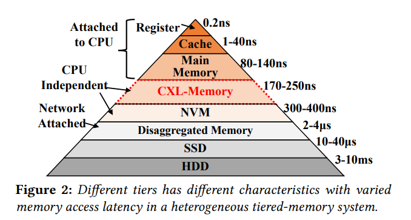
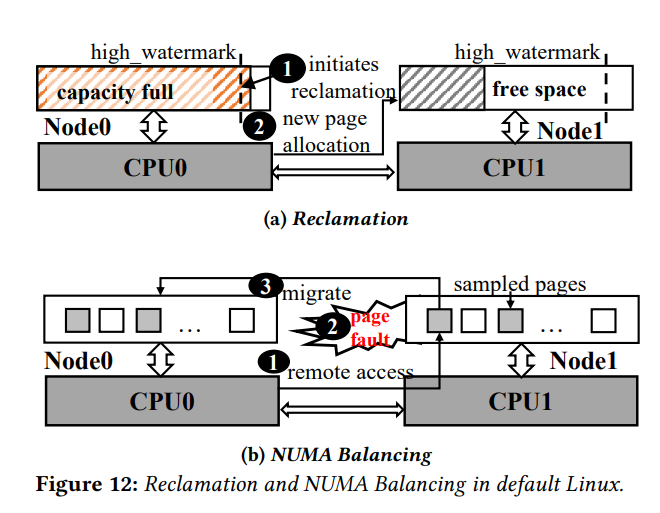
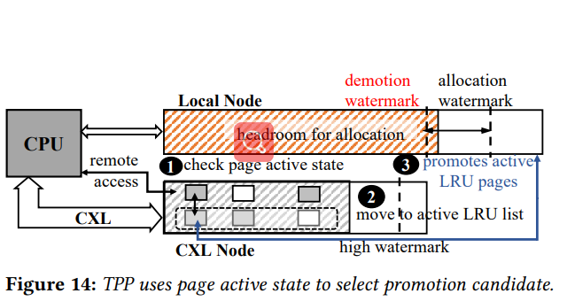

# TPP: Transparent Page Placement for CXL-Enabled Tiered Memory

## Key Takeaway

### Analysis on current design

- In terms of `Page Allocation and Recalmation`
  - when a node is under pressure, free `inactive file cache ==> anon pages ==> file-backed pages ==> page out to swap space`
  - NUMA system find another node for page allocation
  - both allocation and recalmation checks `high_watermark`
  - NUMA Balancing does not consider CPU-less node, and stops migration if target node is under pressure.

### Corresponding solutions

- When local node fills up, instead of `pages out to swap space`, `demote to CXL node`; because accesing CXL is much faster than accessing disks; At failure, swapout to swapspace
- `Decouple Allocation and Reclamation`, different watermark for allocation and reclamation, `demotion earlier than promotion`
- `Page promotion from Remote Nodes`
  - make NUMA Balancing only sample CXL node and not DRAM node
  - ping-pong of `"promoting fake hot pages and later demote it"`
  - only premote pages in active LRU, but put NUMA-faulted pages into active LRU
  - preferrably allocate page caches to CXL Node

---

## Background

- Increased Memory Demand in Datacenter Applications

- Scaling Challenges in Homogeneous Server Designs
  - Memory bandwidth and capacity does not increase proportionally.
  - High coupling of CPU and memory subsystem strands resources.

- CXL for Designing Tiered Memory Systems
  - CXL is an industry-supported interconnect based on the PCI Express (PCIe) interface.
  - CXL enables high-speed, low latency communication between the host processor and devices.
  - CXL-Memory access latency is also similar to the NUMA access latency.

```text
In a word: CXL looks like a CPU-less NUMA node from the perspective of a software.
```



- Scope of CXL-Based Tiered Memory Systems
  - The author characterizes 4 popular applications in Meta's fleet.

## Major Contributions

- Chameleon, a lightweight **user-space memory characterization tool**. Note that Chameleon is an offline tool, whose purpose is to gain prior knowledge about the production workload's memory consumption behavior.
- TPP, **a kernel machinism** for efficient memory management on tiered-memory system

## Design

### Chameleon

```text
chameleon, a user space tool, utilizes the PEBS mechanism of a CPU's PMU to collect the temperature of pages that triggers specific events.
```

- Collector
  - Collect virtual address and PID of pages that triggers: `MEM_LOAD_RETIRED.L3_MISS` and `MEM_INST_RETIRED.ALL_STORES`.

  - To leverage accuracy and overhead, one sample for every 200 events is a good tradeoff.[sample_period = 200]

  - To avoid CPU stalling, rotate to a divided CPU core group.
  
- Worker
  - Track the temperature of all the pages reported by the collector with a 64-bit bitmap

### Production Workload Overview

- A significant portion of a datacenter application’s accessed memory remain cold for minutes. Tiered-memory system can be a good fit for such cold memory.
- A large fraction of anon pages tend to be hot, while file pages remain cold within short intervals.
- Although anon and file usage may vary over time, applications mostly maintain a steady usage pattern.
- Workloads have different levels of sensitivity toward different memory types.
- Cold page re-access time varies for workloads. Page placement on a tiered memory system should be aware of this to avoid high memory access latency.

### Problems with Linux Page Placement Policy

```text
Problems of vanilla Linux
1. homogenous DRAM-only NUMA nodes
2. tightly coupled memory allocation and reclamation
3. NUMA Balancing may trap hot pages in slower memory tier, because it halts premotion if destination memory node dissatisfy high watermark
```

- Original Linux is designed for homogenous DRAM-only NUMA nodes.
- Page allocation and reclamation are tightly coupled
  - Memory Zone maintains: min, low, high watermark
  - Frees inactive file cahes, anon, mapped file pages
  - Only after enough memory has been freed to satisfy local memory node’s high_watermark, will local allocation happen.
  - Due to the fact that relcamation is slower that allocation, local memory halts frequently and degrade application performance.



- NUMA Balancing
  - An existing Kernel feature that moves pages to a memory node closer to the CPU.
  - Routinely samples a subset of CPU's allocated memory on each memory node and clear present bit on their flags.
  - NUMA hint fault, rather than page fault is triggered when accessing a sampled page.
  - Promotion is the action of migrating a sample page to the local memory node of the latest CPU that tried to access it.
  - NUMA Balancing makes the assumption that all memory nodes are attached to CPUs.
  - Also NUMA Balancing checks whether the high watermark is satisfied for the destination memory node before premotion, if not, the migration process halts.

### TPP design

```text
1) lightweight demotion to CXL-Memory:
migrate to CXL node, which is still in memory; instead of swapping out

2) decoupling allocation and reclamation path:
reclaim earlier than allocate, asynchronously

3) hot-page promotion to local nodes:
a) solve ping-pong issue[wrongly premote pseudo hot pages]
b) identify trapped hot pages[active LRU members and revisited inactive LRU members]

4) prefer anon pages to local node while preferring cache pages to CXL node
```

- Migration for Lightweight Reclamation

    When local memory node fills up,

    **Original Linux:** pages-out to swap device

    **TPP:** put to a separate demotion list and try to migrate to CXL-node asychronously

    Both use LRU algorithm to select victim

    **TPP:** demoted pages still in memory; look for both inactive file and anon pages

    If **TPP** migration fails during demotion, fall back to default reclamation(pages out to the swap device)

    Given multiple CXL-nodes, demotion target chosen based on the node distances from the CPU

- Decoupling Allocation and Reclamation
  - background reclamation until demotion_watermark, allocation satisfies allocation_watermark
  - demotion watermark higher than allocation watermark, because reclamation is always quicker than allocation
  - control aggressiveness with /proc/sys/vm/demote_scale_factor, default value 2%, means eclamation starts as soon as only a 2% of the local node’s capacity is available to consume.

- Page Promotion from Remote Nodes
  - Keep NUMA Balancing only sample CXL-nodes. Promote hot pages in CXL node regardless of destination local node's water mark[allocation]
  - NUMA Balancing may migrate pseudo hot pages, causing demotion-premotion ping pong
  - TPP will check the page's position in the LRU list; only active LRU members are considered promotion candidate;
  - If a CXL-node is not under pressure, hot pages can be trapped in inactive LRU.
  - TPP address this issues by instantly mark NUMA-hint fault pages as accessed and move them to active LRU immediately. They will be promoted if the are still hot at the next NUMA hint fault.

    

- Page Type-Aware Allocation
  - Unnecessary page migrations: cold file caches are demoted to CXL-nodes; local memory node is occupied file caches forces anon pages be allocated on CXL-nodes and later be premoted back.
  - TPP: allocate caches(file cache, tmpfs) to CXL node preferrably, if a cache is hot to be premoted, it will eventually
