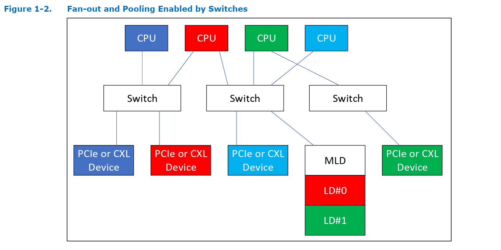
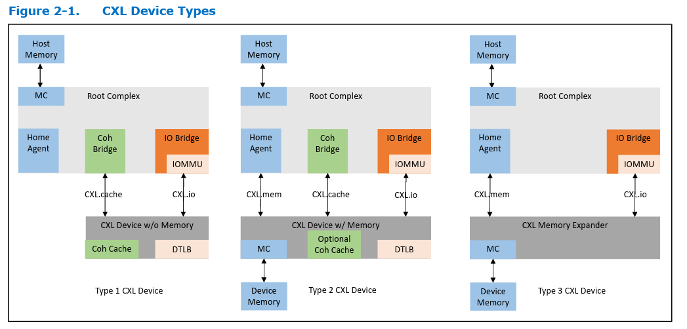
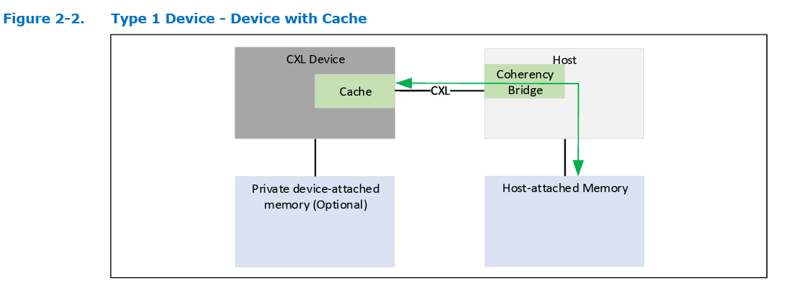
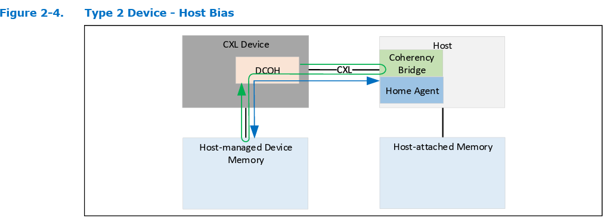
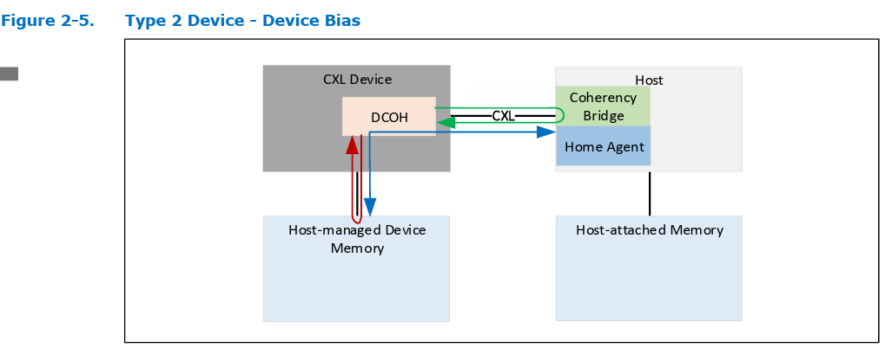
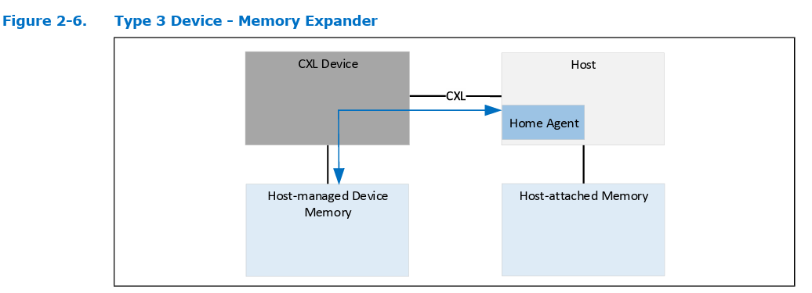
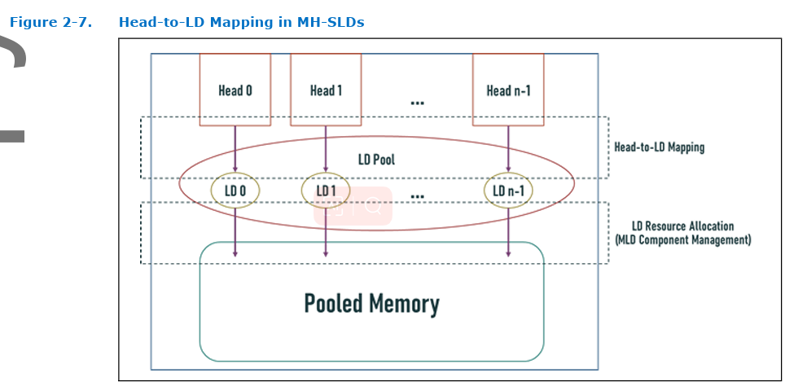
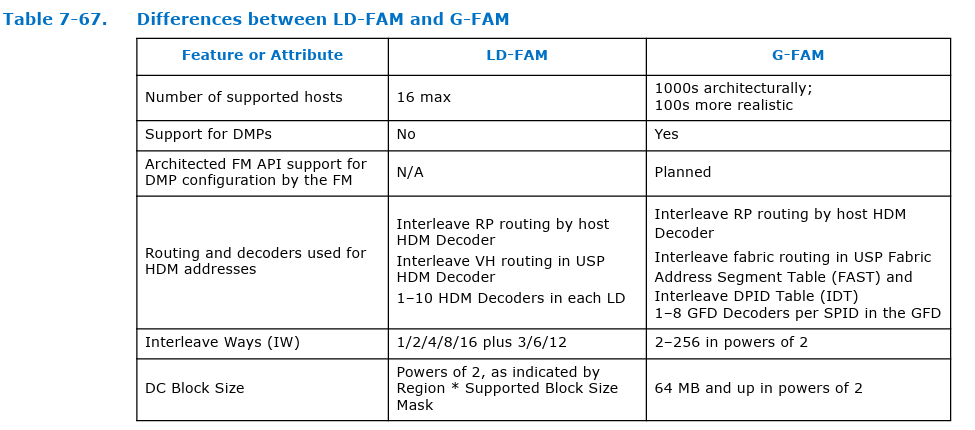

# Diving into CXL 3.0 Spec

## 1.0 Introduction

## 1.4 Motivation and Overview

### 1.4.1 CXL

- CXL.io: discovery and enumeration, error reporting, P2P accesses to CXL memory
- CXL.cache + CXL.mem

CXL 2.0 addtional usage models:

- hot-plug, security, pmem support
- Single-level Fan-out and pooling enabled by switches

CXL 3.0 addtional features:

- doubled the bandwidth
- `Multi-level switching`, up to 4096 ports
- Enable direct Peer-to-Peer accesses to HDM memory using UIO (and also MMIO)
- `Snoop filter` can be implemented in type 2 and type 3 devices using `back-invalidate channels` introduced in `CXL.mem`

### 1.4.2 Flex Bus

Allow choosing between native PCIe protocol or CXL

## 2.0 CXL System Architecture

Type 2 and Type 3 device memory that is exposed to the host is called `Hist-Managed Device Memory`, or `HDM`

The management of `HDM` has 3 options:

- Host-only Coherent, `HDM-H`
- Device Coherent, `HDM-D`
- Device Coherent using Back-Invalidation Snoop, `HDM-DB`

## 2.1 CXL Type 1 Device

## 2.2 CXL Type 2 Device

two methods of resolving device coherence of HDM:

- uses CXL.Cache to manage coherence of the HDM
  - Host Bias
    - `device-attached memory` appears to the device just as `regular host-attached memory` does
  
    - DCOH = Device Coherency Agent
    - `device access to device-attached memory is not optimal`
  - Device Bias
    - Host does not cache any line of the device-attached memory
  
    - Host can still access device-attached memory but may be forced to give up ownership by the accelerator, leading to `compromised performance`
  - Host sees a uniform view of device-attached memory regardless of bias state
  - To maintain Bias modes, a CXL Tye 2 device should:
    - implement `Bias Table` that tracks 4k page granularity Bias
    - Support `Bias transitions` using a Transition Agent, looking like a DMA engine that `flushes the host's caches for lines belonging to a page` when cleaning it up
- uses the dedicated channel in CXL.mem called Back Invalidation Snoop
  - Enables new channels in the `CXL.mem` protocol that allow direct snooping by the device to the host using a dedicated `Back-Invalidation Snoop(BISnp) channel`. The response channel for these snoops is the `Back-Invalidation Response (BIRsp) channel.`
  - The `coherence flows to the host` for the HDM-DB must `only` use the `CXL.mem S2M BISnp`(Subordinate to Master) channel and not the `D2H CXL.cache`(Device to host) Request channel.
  - HDM-DB support is required for all devices that implement 256B Flit(Link Layer Unit of Transfer) mode, but the HDM-D flows will be supported for compatibility with 68B Flit mode.

## 2.3 CXL Type 3 Device

## 2.4 Multi Logical Device (MLD)

Multi-Logical Device:

- A `Type 3 Multi-Logical Device (MLD)` can `partition its resources` into up to 16 isolated `Logical Devices`.
- Each Logical Device is identified by a `Logical Device Identifier (LD-ID)` in `CXL.io` and `CXL.mem` protocols.
- Each Logical Device visible to a Virtual Hierarchy (VH) operates as a Type 3 device. The LD-ID is transparent to software accessing a VH.
- An MLD component has `one LD reserved` for the `Fabric Manager (FM)`. The FM-owned LD (FMLD) allows the FM to configure resource allocation across LDs and manage the physical link shared with multiple `Virtual CXL Switches (VCSs)`.
- The MLD component contains one `MLD DVSEC`(Designated Vendor-Specific Extended Capability) that is `only accessible by the FM` and addressable by requests that carry an LD-ID of FFFFh in CXL LD-ID TLP Prefix. `Switch` implementations `must` guarantee that `FM is the only entity that is permitted to use the LD-ID of FFFFh`.

what does `DVSEC` do?(Not sure if this is talking about Logic device)

- CXL 1.1 device appear as `RciEP(Root Complex Integrated Endpoint)` in enumeration hierarchy
- CXL 2.0 devices are only visible to OS as standard PCIe endpoint wutg a Type0 header
- `CXL DVSEC`(Vendor ID 1e98) with `DVSEC` ID 0 helps distinguish between PCIe endpoint or CXL 2.0 device

### 2.4.3 Pooled Memory and Shared FAM

- HDM(Host-Managed Device Memory) that is exposed from a device that supportes multiple hosts is referred to as Fabric-Attached Memory, or `FAM`
- `FAM` exposed via Logical Devices is known as `LD-FAM`
- `FAM` exposed via Port-Based Routing links is more scalabled, known as Global-FAM, or `G-FAM`
- `FAM` where `each HDM region` is dedicated to a single host interface is called `pooled memory` or `pooled FAM`
- `FAM` where multiple host interfaces are configured to access a single HDM region concurrently is known as `Shared FAM`

## 2.5 Multi-Headed Device

`SLD` stands for Single Logical device, `MLD` stands for Multi-Logical device

A Type 3 device with `multiple CXL ports` is considered a `Multi-Headed Device`. Each port is referred to as a head.

two types of MLD:

- MH-SLD, which present SLDs on all heads

- MH-MLD, which may present MLDs on any of their heads
  - Multiple LDs are mapped to at most one head.
  - A head in a Multi-Headed Device shall have at least one and no more than 16 LDs mapped.
  - A head with one LD mapped shall present itself as an SLD and a head with more than one LD mapped shall present itself as an MLD.

Management of heads in Multi-Headed Devices follows the model defined for the device presented by that head

Management of memory resources in Multi-Headed Devices `follows` the model defined for `MLD components` because both MH-SLDs and MH-MLDs must support the isolation of memory resources, state, context, and management on `a per-LD basis`.

Multi-Headed Devices expose a dedicated Component Command Interface (CCI), the LD Pool CCI, for management of all LDs within the device.

## 2.7 CXL Fabric & 2.8 Global FAM (G-FAM) Type 3 Device

What is a CXL Fabric?

- CXL Fabric describes features that rely on the `Port Based Routing (PBR)` messages and flows to enable scalable switching and advanced `switching topologies`.
- A CXL Fabric is `a collection of one or more switches` that are each `PBR capable` and `interconnected with PBR links`.

How are devices attached to the Fabric?

- G-FAM device attach is supported natively into the fabric.
- Hosts and devices use standard messaging flows `translated` to and from `PBR format` through edge switches in the fabric.

What is `G-FAM`?

- A G-FAM device (GFD) is a `Type 3 device` that connects to a CXL Fabric using `a PBR link`.
- A GFD’s single Logical Device is owned by the Fabric Manager.
- There will be associated `FM API` and `host mailbox interfaces` updated in the future

`G-FAM` V.S. `LD-FAM`

What is the Fabric's capability?

- PBR enables a flexible low-latency architecture supporting up to `4096 PBR IDs` in each fabric.
- A Domain is of a set of Host Ports and Devices within a single coherent Host Physical Address (HPA) space. A CXL Fabric connects one or more Host Ports to the devices within each Domain.

## Quick Conclusion for Chapter 2

### Type 2 device

HDM-D, D for device-coherent

- Use CXL.cache to manage coherence of HDM
  - Host Bias
  - Device Bias
- To maintain Bias mode:
  - Bias Table tracks Bias in 4K granularity
  - Need a Transition Agent to clean up host's caches for line belonging to a page

HDM-DB, D for device-coherent, B for back invalidation

- Use BISnp channel in CXL.mem to manage coherence of HDM
- Coherence flow to the host must use CXL S2M BISnp channel
- HDM-DB support and HDM-D support have something to do with Flit mode(Link Layer)

### Type 3 device

MLD, Multi-Logical Device

- can partition its resources into 16(max) Logical Devices, each identified by a `LD-ID`
- one `LD` is preserved for Fabric Manager with the LD-ID of `FFFFh`, also MLD contains a `MLD DVSEC` that is only accessible by the FM.

FAM, Fabric-Attached Memory

- Exposed via Logical Device, is called `LD-FAM`
  - Variants by Logical Device: Multi-headed Single-Logical Device, Multi-headed Multi-Logical Device; known as `MH-SLD` and `MH-MLD`
- Exposed via PBR links is called `G-FAM`

Multi-Headed Device

- A Type 3 device with multiple CXL ports
- Expose a Component Command Interface  known as `CCI`, for management of all the LDs within the device

CXL Fabric

- a collection of switches taht are each PBR capable and interconnected with PBR links
- PBR enables up to 4096 PBR IDs in each Fabric

## 3.0 CXL Transaction Layer