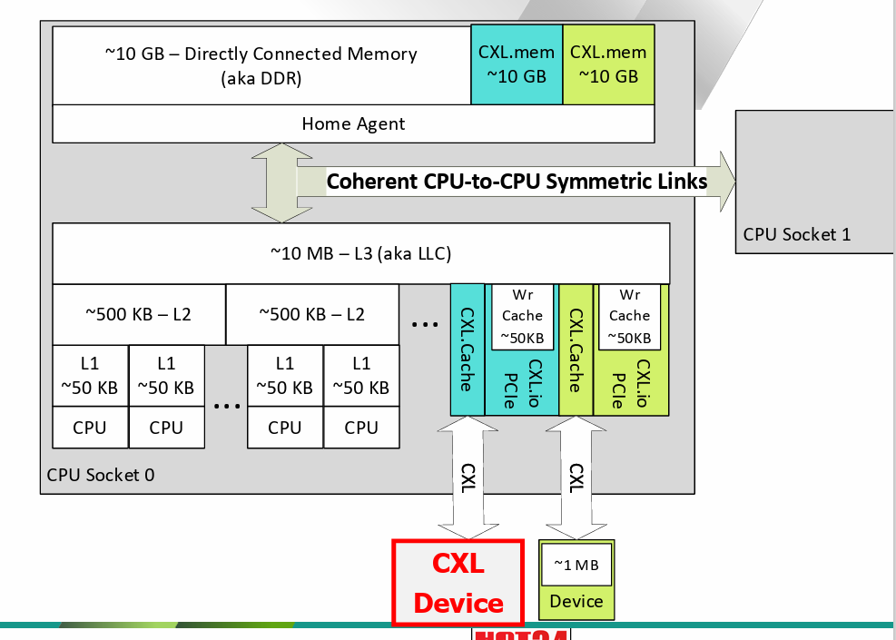
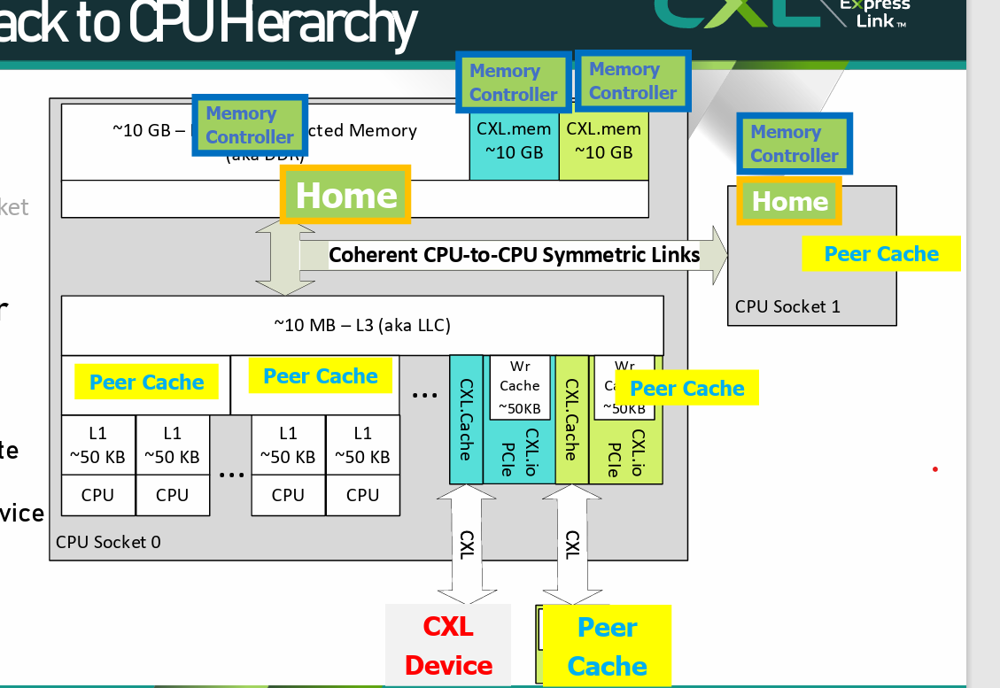
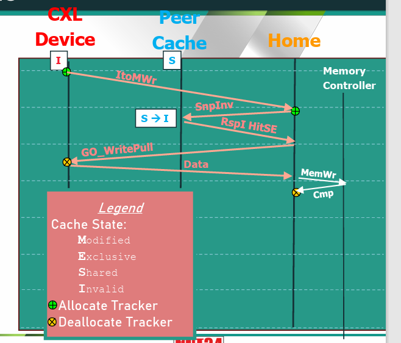
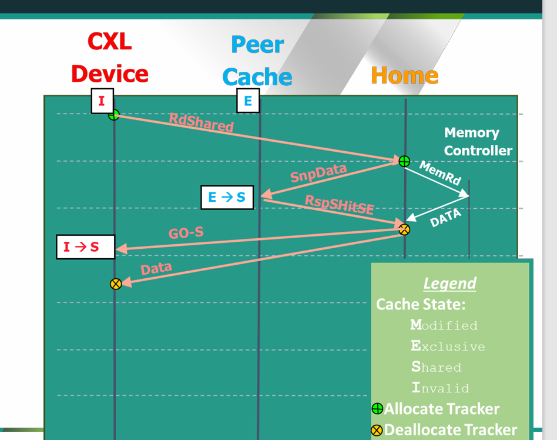
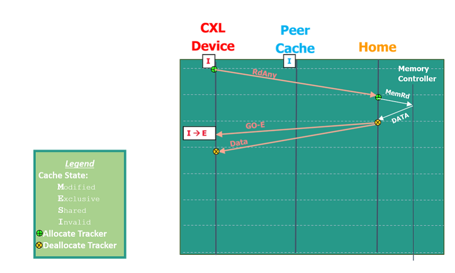
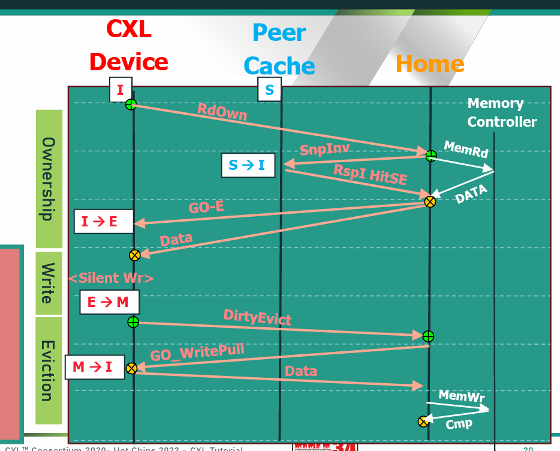

# Cache Coherent CXL

## Caching Primer

- Caching temporarily brings data closer to its consumer
- CPU cache:L1, L2, L3 cache, sizes increases from 32KB to 1.375 MB, latency increases from 2ns to 30ns

```text
suppose need to put cacheline at physical address 0xABCDEC80 into L1 cache, 32KB and 8way

each way: 32KB/8 = 4KB
each cacheline 64 byte, therefore #sets = 4KB/64B = 64

TAG:0xABCDE
SET:0b1100 10
cacheline alignment: 0b00 0000
```

In CXL-supported systems, host cacheline will be cached in CXL devices, and the hardware will keep its consistency; like a core in a CPU

cachelines are stored in memory, and managed by Home Agent(HA)

```text
temporarily ignoring L1, L2 cache in a dual-CPU system and only considering L3 cache + memory

a cacheline of data can only be in 3 places: CPU0.HA or CPU1.HA, CPU0.L3, CPU1.L3
```

read a cacheline:

- goto its home agent
- HA will visit each CPU.L3, if nobody has the newest version, HA will return its the data from memory

write a cacheline:

- goto its home agent
- HA will visit each CPU.L3, and make them discard that cacheline, and then give you the right to modify it

- Cache consistency: How to make sure updates in cache are visible to other agents?
  - Define `Global Observations` aka `GO`, when new data is visible from writes
  - Tracking granularity is a cacheline, 64 bytes for CXL
  - All addresses are assumed to be Host Physical Addresses(HPA) in CXL cache

- MESI protocol
  - `M`odified, `E`xclusive, `S`hared, `I`nvalidated
  - `M`: cache block is dirty and has not been updated to HA
  - writing into `E` does not require data snooping, while writing into `S` does
  - Local read into `I`:
    - if no other cores has the data, read from HA, and set to `E`
    - if another core has `M`, writeback the data to HA and then read from HA and set both to `S`
    - if other cores have `E`/`S`, read from HA and set all to `S`
  - Local write into `I`:
    - if no other core has the data, read from HA, and update the cache, set to `M`
    - if another core has `M`, writeback the data to HA, and perform the above operation
    - if other cores have `E`/`S`, read from HA and set all other cores to `I`
  - Local read into `E`: set to `S`
  - Local write into `E`: set to `M`
  - Remote read into `E`: set to `S`
  - Remote write into `E`: set to `I`
  - Local write into `S`: set to `M` and `I`nvalidate all other cache
  - Remote write into `S`: set to `I`
  - Remote read into `M`: writeback data into HA and set to `S`
  - Remote write into `M`: writeback data into HA and set to `I`

- Manage Peer Cache: `Snooping`
  - All peer caches are manages by the Home Agent within that cache level
  - Snooping is the term for HA to check cache state and cause cache state changes
  - Snoop Invalidate(`SnpInv`): cause a cache to degrade to `I` state, and must return any modfied data
  - Snoop Current(`SnpCurr`): does not change chache state, but does return indication of current state and any modifed data

## CXL.cache

Summary:

- 15 operations from device to host memory
- keep complexity of global coherence management in the host
- CXL3 enables up to 16 cache devices below each root port



Peer Cache can be: CXL Device Cache, CPU L2 cache, Remote CPU socket cache

Memory Controller can be: native DDR on local/remote socket, CXL Device


- Stream Write flow



Good side: less operations on CXL side

Bad side: peer cache not visible until `GO_WritePull`, leading to reduced Bandwidth for ordered traffic

- 15 Requests in CXL
  - Reads: `RdShared`, `RdCurr`, `RdOwn`, `RdAny`
    - `RdShared`: full cacheline read requests from the device to be cached in `S`, typically recieves `GO-S`
    - `RdAny`: full cacheline read requests from the device to be cached in any state, typically recieves `GO-S/E/M`
    - `RdOwn`: full cacheline read requests from the device to be cached in any writeable state, typically recieves `GO-E/M`
    - `RdOwnNoData`: Request exclusive ownership of the cacheline, typically recieves `GO-E`
    - `RdCurr`: full cacheline read requests from the device to get the most current data, but not change the existing state in any cache. Gets a data, but `no GO`
  - Reads example 1:
  
  `RdShared` hit `E/M` with peer in state `E`;
  - Reads example 2:
    - `RdShared` hit `E/M` with peer in state `M`;
    - Peer cache return `RspSFwdM` and also the data to Cache Agent
    - The Cache Agent set from `E/M` to `M`
  - Reads example 3:
    - `RdOwn` hit `E/M` with peer `S/E`, CA send `SnpInv`
    - Peer cache return `RspIHitSE` and set to `I`
    - CA send `GO-E` and the data to the device
  - Reads example 4:
    - `RdOwn` hit `E/M` with peer `M`, CA send `SnpInv`
    - Peer cache return `RspIFwdM` and also the data to CA, set state to `I`
    - CA set from `E/M` to `M`
    - CA send `GO-E` and the data to the device
    - The deivce is set to `E`
  - Reads example 5:
  
  - Compare with Core Data Read Flow(1 processor, Hit `I`)
    - core(L2 cache) issues `DRD`(data read, equivalence to `RdAny`) to CA(L3 cache)
    - CA issues `RdData` to Home Agent, HA issues `MemRd` to Memory Controller
    - Memory Controller returns `Data` to HA, HA returns `DataC_E_Cmp`(C is for `coherent`, E is for `exclusive`, Cmp for `completion`)
    - CA changes from `I` to `E`, and send `GO-E` with the data to the core, the core changes from `I` to `E`
  - Compare with Core Data Read flow(2 processors)
    - HA need to `SnpData` additionally
  - Read-0(get 0 data but cache state): `RdownNoData`, `CLFlush`, `CacheFlushed`
  - Writes: `DirtyEvict`, `CleanEvict`, `CleanEvitcNoData`
  - Writes example 1:
  
  why not just send Data? Why `GO_WritePull`? Need pre-allocation
  - Streaming Writes: `ItoMWr`, `WrCur`, `WOWrInv`, `WrInv(F)`
- Conflict Resolution
  
- Device Bias VS Host Bias

## CXL.mem


## Additional Q & A

1. CXL conflict: racing for a cacheline; no intermediate state
2. lower snoop overhead: `Directory` record CL state in other CAs??; `HIT ME` cache??
3. snoop filter?
4. UPI protocol inter-processor interconnection
5. link layer, transition layer
6. HDM-DB DCOH(device coherence??), different snoop channel
7. 

微信公众号：Tarzan pan 泰山N思维
CXL_3.0 specification release_final
CXL_3.0_white paper final
hot chips 2022 cxl3 coherence deep dive.pdf
www.intel.com/programmable/technical-pdfs/683852.pdf