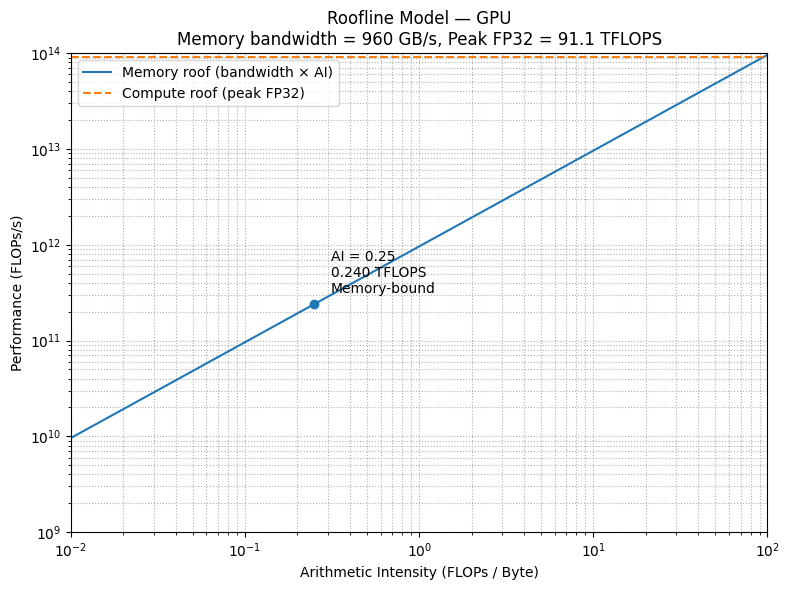
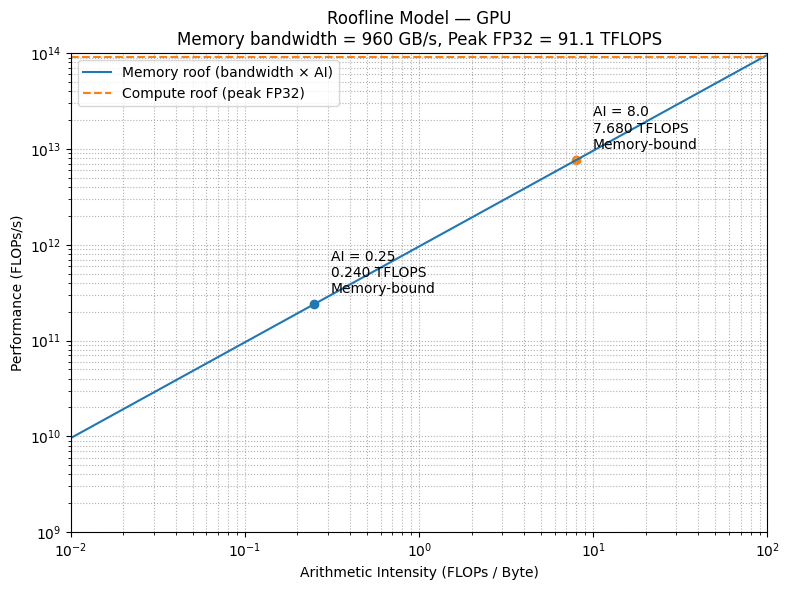
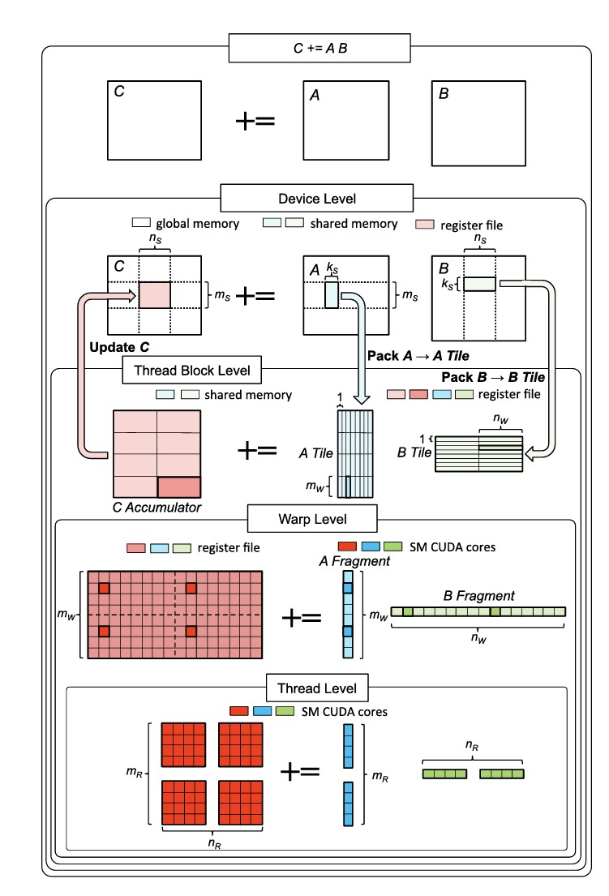

# SGEMM CUDA kernel

As a part of my school project, I need to write a CUDA kernel that performs a matrix multiplication of `M`, `N`, `K`, with `K` being the inner dimension.

> In the following blog, I will denote the matrices with `A` (`M × K`), `B` (`K × N`) and their product `C` (`M × N`)

## Test Environment Setup

I am running my kernels on `AD102GL [RTX 6000 Ada Generation]`, `CUDA ver12.2`, on the school server. Important spec listed as following:

|Entry|Value|
|-|-|
|Memory bandwidth|960 GB/s|
|Single-precision performance|91.1 TFLOPS|
|Shared Memory per Block|48.00 KB|
|Number of SMs|142|
|Max Threads per SM|1536|
|Max Threads per Block|1024|
|Registers per SM|65536|
|Registers per Block|65536|
|Warp Size|32 threads|
|Max Warps per SM|48|

## SGEMM

- `S`: Single precision, `float` is used
- `GEMM`: $C = \alpha AB + \beta C$

> Without the loss of generality, we discuss the special case of $\alpha = 1, \beta = 0$

## CPU version

```cpp
#define OFFSET(row,col,nrows,ncols) ((row) * (ncols) + (cols))
void GTruthMatmul(const float *A,
                const float *B,
                float *C,
                int M, int K, int N) {
    for (int m = 0; m < M; m++) {
        for (int n = 0; n < N; n++) {
            float sum = 0.0f;
            for (int k = 0; k < K; k++) {
                sum += A[m][k] + B[k][n];
            }
            C[OFFSET(m, n, M, N)] = sum;
        }
    }
}
```

I view the three nested loops in this way. **For each element** in the product `C`, which is of shape (`M × N`), perform dot product of **one row vector of `A`** and **one col vector of `B`**. From my own experience, thinking from the perspective of each element in the product matrix is very helpful.

> In my definition, `OFFSET` still takes `nrows` as an input variable even though `nrows` is never used. I define it that way because it saves me (as a beginner) the effort of figuring out whether to put `M`/`N`/`K`, instead simply just put `M, N`/`N, K` there.

## Naive GPU Implementation (v0)

With the same mindset, we can write a baseline CUDA kernel.

```cpp
__global__ void sgemm_v0(float * __restrict__ A,
                        float * __restrict__ B,
                        float * __restrict__ C,
                        const int M,
                        const int K,
                        const int N) {
    int global_row = blockIdx.y * blockDim.y + threadIdx.y;
    int global_col = blockIdx.x * blockDim.x + threadIdx.x;
    int global_idx = OFFSET(global_row, global_col, M, N);

    if (global_row < M && global_col < N) {
        float sum = 0.0f;
        for (int k = 0; k < K; k++) {
            sum += A[OFFSET(global_row, k, M, K)] * B[OFFSET(k, global_col, K, N)];
        }
        C[global_idx] = sum;
    }   
}
const int BLOCK_SIZE = 16;
dim3 block_size(BLOCK_SIZE, BLOCK_SIZE);
dim3 grid_size(CEIL(N, BLOCK_SIZE), CEIL(M, BLOCK_SIZE));
sgemm_v0<<<grid_size, block_size>>>(d_A, d_B, d_C, M, K, N);
```

The `row`, `col` terminology we use in indexing matrix and the `x`, `y` terminology used in identifying thread are definitely confusing on first sight.

> `__restrict__`, just like many other keywords, is a hint to the compiler. This one states that within the scope of that pointer's lifetime (`sgemm_v0`), the memory region pointed to by that pointer will not be accessed. Its primary purpose is to enable **more aggressive compiler optimizations**, potentially leading to **performance improvements**.

The problem with this naive kernel is memory access, actually the total computation or `FLOPs` (Float Operations) is the same no matter how we optimize it in the following kernels. Let's do the math here:

> For each element in the product `C`(`M × N`), we perform a inner product of two vectors of lenth `K`, which is effectively `K` multiplications and `K` additions (we add the first element to `0.0f`, so not `K - 1`), haveing a total of FLOPs of

$$MN(K + K) = 2MNK$$

What about memory accesses? or more precisely **global memory** accesses?

> For each element in the product `C`(`M × N`), to perform the dot product, we load `K` elements from `A` and another `K` elements from `B`, and store `1` element to `C`, therefore total memory accesses of

$$MN(K + K + 1) = MN(2K + 1)$$

The arithmetic intensity of the approach is thus:

$$\frac{2MNK}{MN(2K + 1) \times 4} \approx 0.25$$

Thinking about arithmetic intensity is crucial in deciding whether its memory-bound or compute-bound. Let's check the roofline model:



Measured `sgemm_v0` performance (on `M = N = K = 4096`) is `4.750 TFLOPs/s`, around $14.96\%$ of cuBLAS performance, but much better than the roofline model pinpointed value, mostly because neighboring threads' accesses to global memory are **coalesced**.

## Shared Memory Tiling (v1)

One can also think about `sgemm_v0` from another perspective, each row of `A` is loaded multiple times (`N` times to be specific), which is a huge waste, because many threads could have re-used loaded data. For exmaple, thread `t0` which is responsible for calculating `C(0, 0)` and thread `t1` which is responsible for calculating `C(0, 1)`, both load `A[0][:]`

On one end, if we can load the entire matrix to shared memory of a block (`TILE_SIZE = Order`), then we don't need to load elements for even a second time. On the other end, if `TILE_SIZE = 1`, this falls back to `sgemm_v0`.

Instead of loading `vecA(1, K)` and `vecB(K, 1)` into per-thread register space, here we are loading `vecA(TILE_SIZE, K)` and `vecB(K, TILE_SIZE)` into per-block shared memory. Since these sizes are too large, we break them into tiles and accumulate them by `phase`s.

```cpp
template <const int TILE_SIZE>
__global__ void sgemm_v1(float * __restrict__ A,
                        float * __restrict__ B,
                        float * __restrict__ C,
                        const int M,
                        const int K,
                        const int N) {
    __shared__ float As[TILE_SIZE][TILE_SIZE];
    __shared__ float Bs[TILE_SIZE][TILE_SIZE];

    /* block row = offset (with respect to the grid) introduced by block */
    int block_row = blockIdx.y * TILE_SIZE;
    int block_col = blockIdx.x * TILE_SIZE;
    /* thread row = offset (with respect to the block) introduced by threads */
    int thread_row = threadIdx.y;
    int thread_col = threadIdx.x;
    float sum = 0.0f;
    /* Accumulate by phase */
    for (int ph = 0; ph < CEIL(K, TILE_SIZE); ph++) {
        int global_row_a = block_row + thread_row;
        int global_col_a = ph * TILE_SIZE + thread_col;
        if (global_row_a < M && global_col_a < K) {
            As[thread_row][thread_col] = A[OFFSET(global_row_a, global_col_a, M, K)];
        } else {
            As[thread_row][thread_col] = 0.0f;
        }

        int global_row_b = ph * TILE_SIZE + thread_row;
        int global_col_b = block_col + thread_col;
        if (global_row_b < K && global_col_b < N) {
            Bs[thread_row][thread_col] = B[OFFSET(global_row_b, global_col_b, K, N)];
        } else {
            Bs[thread_row][thread_col] = 0.0f;
        }
        __syncthreads();

        for (int k = 0; k < TILE_SIZE; k++) {
            sum += As[thread_row][k] * Bs[k][thread_col];
        }
        __syncthreads();
    }
    int global_row_c = block_row + thread_row;
    int global_col_c = block_col + thread_col;
    if (global_row_c < M && global_col_c < N) {
        C[OFFSET(global_row_c, global_col_c, M, N)] = sum;
    }
}
dim3 block_size(TILE_SIZE, TILE_SIZE);
dim3 grid_size(CEIL(N, TILE_SIZE), CEIL(M, TILE_SIZE));
sgemm_v1<TILE_SIZE><<<grid_size, block_size>>>(d_A, d_B, d_C, M, K, N);
```

Computation of each block computation `vecA(TILE_SIZE, K)` multiply `vecB(K, TILE_SIZE)`:

$$2\times T \times K \times T = 2 T^2K$$

Memory accesses of each block:

$$TK + KT + T^2$$

Arithmetic intensity:

$$\frac{2 T^2K}{(TK + KT + T^2) \times 4} \approx 0.25 T$$

> With shared memory, arithmetic intensity is amplified by `TILE_SIZE` compare with `sgemm_v0` because of the reduced global memory access

Assuming a `TILE_SIZE = 32`:



Measured `sgemm_v1` performance (on `M = N = K = 4096`) is `7.273 TFLOPs/s`, about $23.82\%$ that of cuBLAS.

## Thread Tile, Vectorized load, Reduced bank conflict (v2)

### Thread Tile

Previously, when we calculate arithmetic intensity, we think about number of memory accesses to global memory. What about shared memory?

In the previous version, after loading `As` and `Bs` (the first `__syncthreads()`), each thread reads one row from shared memory, `As[thread_row][:]` and a column `Bs[:][thread_col]` and perform dot product. After reading off these elements, these values are evicted off the register space, which is a huge waste.

What if each thread read a few rows and a few cols from shared memory, and calculate a block of elements, just like what we did with shared memory tile? Each row and col will be re-used for `THREAD_TILE_SIZE` times, thus **reducing shared memory access by `THREAD_TILE_SIZE` times less**.

```cpp
/* block row = offset (with respect to the grid) introduced by block */
int block_row = blockIdx.y * BM;
int block_col = blockIdx.x * BN;
/* thread row = offset (with respect to the block) introduced by threads */
int thread_row = threadIdx.y * TM;
int thread_col = threadIdx.x * TN;
int nthreads = blockDim.x * blockDim.y;
int tid = threadIdx.y * blockDim.x + threadIdx.x;
```

### Vectorized load

CUDA also provides SIMD-like semantics, enabling each thread to load 4 floats instead of just 1 at a time from memory (global memory/shared memory).

```cpp
#define FLOAT4(pointer)	(reinterpret_cast<float4*>(&(pointer))[0])
/* Load B[global_idx : global_idx + 4] to Bs[shmem_row][shmem_col : shmem_col + 4] */
FLOAT4(Bs[shmem_row][shmem_col]) = FLOAT4(B[global_idx]);
```

The caveat is you have to load the 4 floats from an address of a multiple of 16 and not just 4, namely you cannot just load ANY consecutive 4 floats.

> For example, if you are dealing with matrix multiplication of two `15 × 15` matricies with `TILE_SIZE = 4`, a total of `4 × 4` tiles are needed, and `TILE(1, 0)` essentially load `Mat[4:8][0:4]` to shared memory

It is natural to think, why not simply use 4 `float4` to load elements from global memory to `4 × 4` shared memory tile?

> `Mat[4][0] = Mat[60]` would be legal for `float4`operation, while `Mat[5][0] = Mat[75]` is **NOT**

Therefore boundary checking and `float4` viability checking are nasty:

```cpp
auto load_Bs = [&] (int ph) {
    for (int g = tid; g < (BK * BN) / 4; g += nthreads) {
        int shmem_idx = g * 4;
        int shmem_row = shmem_idx / BN;
        int shmem_col = shmem_idx % BN;
        int global_row = ph * BK + shmem_row;
        int global_col = block_col + shmem_col;
        int global_idx = OFFSET(global_row, global_col, K, N);

        if ((global_row < K) && (shmem_col + 3 < BN) &&
        (global_col + 3 < N) && (global_idx % 4 == 0)) {
            FLOAT4(Bs[shmem_row][shmem_col]) = FLOAT4(B[global_idx]);
        } else {
            if (global_row < K) {
                Bs[shmem_row][shmem_col] = (global_col < N) ? B[global_idx] : 0.0f;
                Bs[shmem_row][shmem_col + 1] = (global_col + 1 < N) ? B[global_idx + 1] : 0.0f;
                Bs[shmem_row][shmem_col + 2] = (global_col + 2 < N) ? B[global_idx + 2] : 0.0f;
                Bs[shmem_row][shmem_col + 3] = (global_col + 3 < N) ? B[global_idx + 3] : 0.0f;
            } else {
                Bs[shmem_row][shmem_col] = 0.0f;
                Bs[shmem_row][shmem_col + 1] = 0.0f;
                Bs[shmem_row][shmem_col + 2] = 0.0f;
                Bs[shmem_row][shmem_col + 3] = 0.0f;
            }
        }
    }
};
```

> What I did is, each thread read 4 floats in interleaving fashion. If it is eligible for `float4` operations, do it, otherwise fall back to one by one loading, up to four.

### Reduced bank conflict

**Bank conflict**, in my understanding, happens when multiple threads within the same warp try to access different memory locations of the same memory bank of shared memory.

Previously, we do not have any bank conflict:

> In `sgemm_v1`, since `TILE_SIZE = 32`, which is essentially warp size, all threads in the same warp are accessing the same `As` row and different `Bs` col. `As` row is broadcasted to each thread, while each `Bs` col falls into different memory bank.

But now we do, because each thread is playing with multiple rows at the same time.

> Here, as we are about to see later, we are going to set $BM = 128, BK = 8, BN = 8$, $TM = 8, TK = 8$, which will cause bank conflicts. For each block we have $BN / TN = 16 × BM / TM = 16$ threads. Thread `t0` calculates `C[0:8][0:8]`, by loading `A[0:8]`; while Thread `t16` calculates `C[8:16][0:8]`, by loading `A[8:16]`

There are many ways to reduce bank conflict, like adding an extra column, swizzling. Here I choose to transpose `As` to `AsT` to avoid such problem.

```cpp
auto load_AsT = [&] (int ph) {
    for (int g = tid; g < (BM * BK) / 4; g += nthreads) {
        int shmem_idx = g * 4;
        int shmem_row = shmem_idx / BK;
        int shmem_col = shmem_idx % BK;
        int global_row = block_row + shmem_row;
        int global_col = ph * BK + shmem_col;
        int global_idx = OFFSET(global_row, global_col, M, K);

        if ((global_row < M) && (shmem_col + 3 < BK) &&
        (global_col + 3 < K) && (global_idx % 4 == 0)) {
            float4 f4 = FLOAT4(A[global_idx]);
            AsT[shmem_col][shmem_row] = f4.x;
            AsT[shmem_col + 1][shmem_row] = f4.y;
            AsT[shmem_col + 2][shmem_row] = f4.z;
            AsT[shmem_col + 3][shmem_row] = f4.w;
        } else {
            if (global_row < M) {
                AsT[shmem_col][shmem_row] = (global_col < K) ? A[global_idx] : 0.0f;
                AsT[shmem_col + 1][shmem_row] = (global_col + 1 < K) ? A[global_idx + 1] : 0.0f;
                AsT[shmem_col + 2][shmem_row] = (global_col + 2 < K) ? A[global_idx + 2] : 0.0f;
                AsT[shmem_col + 3][shmem_row] = (global_col + 3 < K) ? A[global_idx + 3] : 0.0f;
            } else {
                AsT[shmem_col][shmem_row] = 0.0f;
                AsT[shmem_col + 1][shmem_row] = 0.0f;
                AsT[shmem_col + 2][shmem_row] = 0.0f;
                AsT[shmem_col + 3][shmem_row] = 0.0f;
            }
        }
    }
};
```

### Same phase-based accumulation process

```cpp

for (int ph = 0; ph < CEIL(K, BK); ph++) {
    load_AsT(ph);
    load_Bs(ph);
    __syncthreads();

    acc_reg();
    __syncthreads();
}
```

Now this version (on `M = N = K = 4096`) hits `26.500 TFLOPs/s`, effectively $83.53\%$ of cuBLAS performance.

## Inner product V.S. Outer product

[In previous section](#cpu-version), we see that one way of doing matrix multiplication is to take dot product (or inner product) of rows in `A` and cols in `B` to have a full element in `C`

Alternatively, one (or cuBLAS) could also use outer product to do matrix multiplication:

```cpp
for (int k = 0; j < K; k++) {
    for (int m = 0; m < M; m++) {
        for (int n = 0; n < N; n++) {
            C[OFFSET(m, n, M, N)] += A[m][k] * B[k][n];
        }
    }
}
```

I view it as, along the inner dimension `K`, take one column `col(M, 1)` in `A` and one row `row(1, N)`in `B`, perform outer product, update according entries in `C`.

```cpp
auto load_Ar = [&] (int k) {
    for (int base = 0; base < TM; base += 4) {
        FLOAT4(Ar[base]) = FLOAT4(AsT[k][thread_row + base]);
    }
};

auto load_Br = [&] (int k) {
    for (int base = 0; base < TN; base += 4) {
        FLOAT4(Br[base]) = FLOAT4(Bs[k][thread_col + base]);
    }
};

auto acc_ffma = [&] () {
    for (int m = 0; m < TM; m++) {
        for (int n = 0; n < TN; n++) {
            acc[m][n] += Ar[m] * Br[n];
        }
    }
};

for (int ph = 0; ph < CEIL(K, BK); ph++) {
    load_AsT(ph);
    load_Bs(ph);
    __syncthreads();

    for (int k = 0; k < BK; k++) {
        load_Ar(k);
        load_Br(k);
        acc_ffma();
    }
    __syncthreads();
}
```

Our main loop is still `phase`-based, with each stage loading `AsT` and `Bs` into shared memory, to reduce global memory accesses.

Within each phase, we perform outer product of `As(BM, BK)` and `Bs(BK, BN)`, and like depicted above, along the inner dimension (`BK`), we take one col from `As`, which is essentially a row from `AsT`, and on row from `Bs`

Further breaking down into per-thread behaviour, each thread load a col segment `Ar(TM, 1)` and a row segment `Br(1, TN)`, perform the outer product, before finally accumulate them in 2D register `acc[TM][TN]`.

This version (`sgemm_v3`) has about the same performance of `sgemm_v2`, with `26.409 TLOPS/s`, which is around $83.68\%$ that of cuBLAS.

### Occupancy

Computation is so much faster than memory accesses in GPU (and also CPU), natively, when a warp is waiting for data movement from global memory to register, or even shared memory to register, the per-block warp scheduler will pick the next runnable warp, instead of stalling and wait for the data.

If there is no runnable warp, then the scheduler has no choice but to wait, and our computation unit is stalling, computation power wasted.

This is where the concept of **occupancy** kicks in.

> Occupancy is defined as the ratio of active warps on an SM to the maximum number of active warps supported by the SM.

One key factor that decided occupancy is resource constraints, such as registers for each thread, shared memory for each block (SM) and [maximum number of concurrent warps](https://docs.nvidia.com/cuda/ada-tuning-guide/index.html?utm_source=chatgpt.com#occupancy).

> Higher occupancy is not always better, because we have more warps to hide memory access latencies, but a too low occupancy is definitely not optimal!

For [my environment setup](#test-environment-setup):

- Each block uses $(BM \times BK + BK \times BN) \times 4 = 8192 = 8\text{KB}$ Shared Memory, plus $1\text{KB}$ for CUDA runtime
- Each block uses $(TM \times TN + TM + TN) \times \frac{BN}{TN} \times \frac{BM}{TM} = 20480$ Registers

From above calculations, block limit by shared memory is $5$, while block limit by registers is $3$, but for most accurate data, we should also check with `NsightNsight Compute` profiler:

```text
Section: Occupancy
------------------------------- ----------- ------------
Metric Name                     Metric Unit Metric Value
------------------------------- ----------- ------------
Block Limit SM                        block           24
Block Limit Registers                 block            2
Block Limit Shared Mem                block            7
Block Limit Warps                     block            6
Theoretical Active Warps per SM        warp           16
Theoretical Occupancy                     %        33.33
Achieved Occupancy                        %        30.91
Achieved Active Warps Per SM           warp        14.84
------------------------------- ----------- ------------
```

Note that the above table makes sense because

$$\text{#warps per block} =\frac{\frac{BN}{TN} \times \frac{BM}{TM}}{\text{Warp Size}} = \frac{16\times16}{32} = 8$$

$$\text{#blocks per SM} = 2$$

$$\text{#warps per SM} = 8 \times 2 = 16$$

$$\text{Occupancy} = \frac{\text{#warps per SM}}{\text{#Max Warps per SM}} = \frac{16}{48} = \frac{1}{3} \approx 33.333\%$$

Our kernel is very balanced, and occupancy looks fine!

## Double Buffering, Warp Tile (v4)

### Double Buffering

Double buffering is another term for pipelining.

Double buffering is simply, loading data into one buffer, and then doing computation in the other. Since there are do data dependencies in this case, while we are fetching data in one buffer, we can do computation in the other one.

The function body is almost identical to previous ones, only that now we have two buffers for `AsT` and `Bs`

```cpp
int ph = 0;
int curr_stage = 0, other_stage = 1;
load_AsT(ph, curr_stage);
load_Bs(ph, curr_stage);
__syncthreads();

for (ph = 1; ph < CEIL(K, BK); ph++) {
    load_AsT(ph, other_stage);
    load_Bs(ph, other_stage);

    #pragma unroll
    for (int k = 0; k < BK; k++) {
        load_Ar(k, curr_stage);
        load_Br(k, curr_stage);
        acc_ffma();
    }
    __syncthreads();
    curr_stage = other_stage;
    other_stage = 1 - curr_stage;
}

for (int k = 0; k < BK; k++) {
    load_Ar(k, curr_stage);
    load_Br(k, curr_stage);
    acc_ffma();
}
__syncthreads();
```

One could also do double buffering not just for shared memory but even for registers!

For this version, `sgemm_v4` has `27.504 TFLOPs/s` performance, around $82.91\%$ of cuBLAS, not very impressive, so did it really work?

|Order|v3(GFLOPS/s)|v4(GFLOPS/s)|
|-|-|-|
|2|0.01|0.01|
|4|0.04|0.04|
|8|0.32|0.31|
|16|1.92|1.95|
|32|9.68|10.49|
|64|43.95|51.55|
|128|142.51|158.31|
|256|681.01|777.47|
|512|3026.11|3524.12|

On small matrices, double buffering works very well, mainly because smaller matrices **in practice** is more memory bound, because there are not enough computations to overlap and hide the memory access latency.

### Warp Tile

To be honest, I do not really know the benefits of warp tiling, and this is on my TODO list.

I get to know about this hierachy from this paper: [Strassen’s Algorithm Reloaded on GPUs](https://dl.acm.org/doi/10.1145/3372419), and they have a really nice and clear illustration.



```cpp
int block_row = blockIdx.y * BM;
int block_col = blockIdx.x * BN;
int tid = threadIdx.y * blockDim.x + threadIdx.x;
int warpId = tid / warpSize;
int laneId = tid % warpSize;
int nwarps_per_block_row = BN / WN;
int warpy = warpId / nwarps_per_block_row;
int warpx = warpId % nwarps_per_block_row;
int warp_row = warpy * WM;
int warp_col = warpx * WN;
int nthreads_per_warp_row = WN / TN;
int nthreads_per_warp_col = WM / TM;
int thready = laneId / nthreads_per_warp_row;
int threadx = laneId % nthreads_per_warp_row;

int nthreads = blockDim.x * blockDim.y;

auto load_Ar = [&] (int k, int shmem_stage) {
    for (int reg_base = 0, piece_base = thready * 4; reg_base < TM; reg_base += 4, piece_base += nthreads_per_warp_col * 4) {
        FLOAT4(Ar[reg_base]) = FLOAT4(AsT[shmem_stage][k][warp_row + piece_base]);
    }
};

auto load_Br = [&] (int k, int shmem_stage) {
    for (int reg_base = 0, piece_base = threadx * 4; reg_base < TN; reg_base += 4, piece_base += nthreads_per_warp_row * 4) {
        FLOAT4(Br[reg_base]) = FLOAT4(Bs[shmem_stage][k][warp_col + piece_base]);
    }
};


auto store_c = [&] () {
    int row_piece_base = thready * 4;
    int col_piece_base = threadx * 4;
    #pragma unroll
    for (int m = 0; m < TM; m++) {
        int m_piece_block = m / 4;
        int m_piece_offset = m % 4;
        int global_row = block_row + warp_row + row_piece_base +
            m_piece_block * (nthreads_per_warp_col * 4) + m_piece_offset;
        if (global_row >= M) break;
        #pragma unroll
        for (int n = 0; n < TN; n++) {
            int n_piece_block = n / 4;
            int n_piece_offset = n % 4;
            int global_col = block_col + warp_col + col_piece_base +
                n_piece_block * (nthreads_per_warp_row * 4) + n_piece_offset;
            if (global_col >= N) break;
            C[OFFSET(global_row, global_col, M, N)] = acc[m][n];
        }
    }
};
```

Warp tiling version only increase performance of previous generation by $2-3\%$ (on `M = N = K = 4096`), which is kind of "Not worth it".

## Final Remarks

- Looking back, from my own experience, thinking about offsets introduced by block, warp, thread is very helpful.
- Building solutions in a progressive and escalating fashion improves my understandings a lot.
- For smaller/larger matrices, finetuning, profiling, adjusting hyper-parameters such as `BM, BK, BN, TM, TK` is very important; Current code only works fine on `M = N = K = 4096`

## Additionally Required

In the original school project, we are also required:

- Find not just one but two minimums of the product `C` and their 2D indices
- Parallelize **as much as possible**! (No sequential reduction in the main process)

## Future Works

1. Have more illustrations
2. Have more Nsight related analysis (school server takes forever to open `nsys-ui`)
3. Consider blank conflict of registers
4. Double buffering for registers
5. PTX analysis and so on

## References

- [Advanced Matrix Multiplication Optimization on NVIDIA GPUs](https://salykova.github.io/sgemm-gpu)
- [How to Optimize a CUDA Matmul Kernel for cuBLAS-like Performance: a Worklog](https://siboehm.com/articles/22/CUDA-MMM)
- [Strassen’s Algorithm Reloaded on GPUs](https://dl.acm.org/doi/10.1145/3372419)