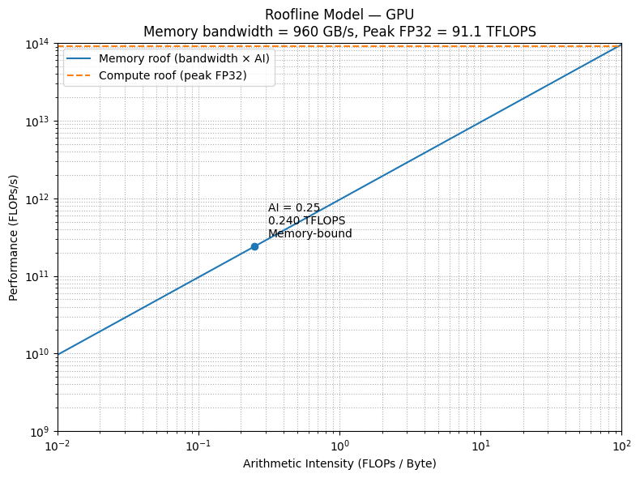
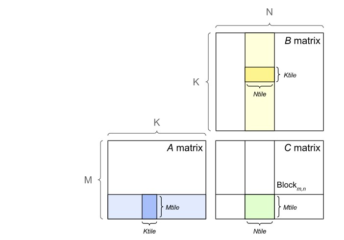
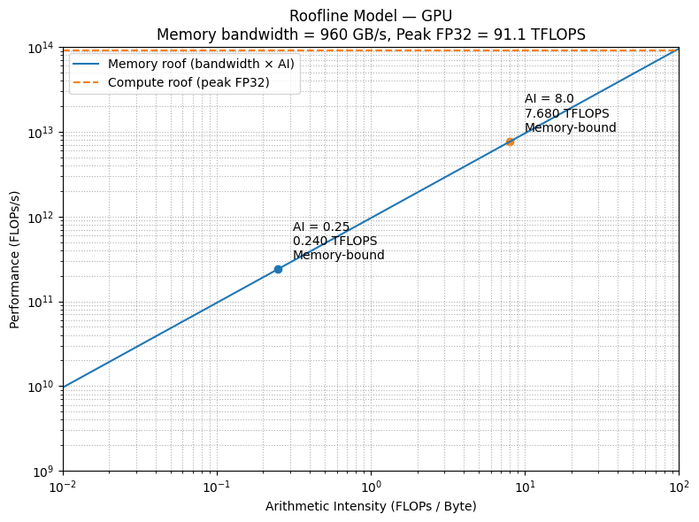

# SGEMM CUDA kernel

As a part of my school project, I need to write an SGEMM CUDA kernel.

- `S`: Single precision, `float` is used
- `GEMM`: $C = \alpha AB + \beta C$

> Without the loss of generality, we discuss the special case of $\alpha = 1, \beta = 0$

Here I will discuss matrix multiplication of dimensions `M`, `N`, `K`, with `K` being the inner dimension.

> In the following blog, I will denote the matrices with `A` (`M × K`), `B` (`K × N`) and their product `C` (`M × N`)

All source code can be found [here](https://github.com/twicy/CUDA).

## Table of Contents

- [Test Environment Setup](#test-environment-setup)
- [Part 1: CPU version](#part-1-cpu-version)
- [Part 2: Naive GPU Implementation (v0)](#part-2-naive-gpu-implementation-v0)
- [Part 3: Shared Memory Tiling (v1)](#part-3-shared-memory-tiling-v1)
- [Part 4: Switching to Outer Product](#part-4-switching-to-outer-product)
  - [FMA](#fma)
  - [Inner Product V.S. Outer Product](#inner-product-vs-outer-product)
  - [Thread Tile (v2)](#thread-tile-v2)
- [Part 5: Reduced bank conflict (v3)](#part-5-reduced-bank-conflict-v3)
- [Part 6: Vectorized load (v4)](#part-6-vectorized-load-v4)
- [Part 7: Occupancy Analysis](#part-7-occupancy-analysis)
- [Part 8: Double Buffering (v5)](#part-8-double-buffering-v5)
- [Part 9: Warp Tile (v6)](#part-9-warp-tile-v6)

## Test Environment Setup

I am running my kernels on `AD102GL [RTX 6000 Ada Generation]`, `CUDA ver12.2`, on the school server. Important spec listed as following:

|Entry|Value|
|-|-|
|Memory bandwidth|960 GB/s|
|Single-precision performance|91.1 TFLOPS|
|Shared Memory per Block|48.00 KB|
|Number of SMs|142|
|Max Threads per SM|1536|
|Max Threads per Block|1024|
|Registers per SM|65536|
|Registers per Block|65536|
|Warp Size|32 threads|
|Max Warps per SM|48|

## Part 1: CPU version

```cpp
#define OFFSET(row,col,nrows,ncols) ((row) * (ncols) + (cols))
void GTruthMatmul(const float *A,
                const float *B,
                float *C,
                int M, int K, int N) {
    for (int m = 0; m < M; m++) {
        for (int n = 0; n < N; n++) {
            float sum = 0.0f;
            for (int k = 0; k < K; k++) {
                sum += A[m][k] + B[k][n];
            }
            C[OFFSET(m, n, M, N)] = sum;
        }
    }
}
```

I view the three nested loops in this way. **For each element** in the product `C`, which is of shape (`M × N`), perform dot product of **one row vector of `A`** and **one col vector of `B`**. From my own experience, thinking from the perspective of each element in the product matrix is very helpful.

> In my definition, `OFFSET` still takes `nrows` as an input variable even though `nrows` is never used. I define it that way because it saves me (as a beginner) the effort of figuring out whether to put `M`/`N`/`K`, instead simply just put `M, K`/`K, N` there.

## Part 2: Naive GPU Implementation (v0)

With the same mindset, we can write a baseline CUDA kernel.

```cpp
__global__ void sgemm_v0(float * __restrict__ A,
                        float * __restrict__ B,
                        float * __restrict__ C,
                        const int M,
                        const int K,
                        const int N) {
    int global_row = blockIdx.y * blockDim.y + threadIdx.y;
    int global_col = blockIdx.x * blockDim.x + threadIdx.x;
    int global_idx = OFFSET(global_row, global_col, M, N);

    if (global_row < M && global_col < N) {
        float sum = 0.0f;
        for (int k = 0; k < K; k++) {
            sum += A[OFFSET(global_row, k, M, K)] * B[OFFSET(k, global_col, K, N)];
        }
        C[global_idx] = sum;
    }   
}
const int BLOCK_SIZE = 16;
dim3 block_size(BLOCK_SIZE, BLOCK_SIZE);
dim3 grid_size(CEIL(N, BLOCK_SIZE), CEIL(M, BLOCK_SIZE));
sgemm_v0<<<grid_size, block_size>>>(d_A, d_B, d_C, M, K, N);
```

The `row`, `col` terminology we use in indexing matrix and the `x`, `y` terminology used in identifying thread are definitely confusing on first sight. `row` and `col` are used when we locate an element in the original matrix, while `x` and `y` are used to identify thread location within a block.

> `__restrict__`, just like many other keywords, is a hint to the compiler. This one states that within the scope of that pointer's lifetime (`sgemm_v0`), memory accessed through the marked pointer will only be accessed through that specific pointer (or pointers derived directly from it) during its lifetime within that scope. Its primary purpose is to enable **more aggressive compiler optimizations**, potentially leading to **performance improvements**.

The problem with this naive kernel is memory access, actually the total computation or `FLOPs` (Float Operations) is the same no matter how we optimize it in the following kernels. Let's do the math here:

> For each element in the product `C`(`M × N`), we perform a inner product of two vectors of lenth `K`, which is effectively `K` multiplications and `K` additions (we add the first element to `0.0f`, so not `K - 1`), haveing a total of FLOPs of

$$MN(K + K) = 2MNK$$

What about memory accesses? or more precisely **global memory** accesses?

> For each element in the product `C`(`M × N`), to perform the dot product, we load `K` elements from `A` and another `K` elements from `B`, and store `1` element to `C`, therefore total memory accesses of

$$MN(K + K + 1) = MN(2K + 1)$$

The arithmetic intensity (AI) of the approach is thus:

$$\frac{2MNK}{MN(2K + 1) \times 4} \approx 0.25$$

Thinking about arithmetic intensity is crucial in deciding whether its memory-bound or compute-bound. Let's check the roofline model:

> Roofline model simply states that $$\text{Attainable Performance} = \max(\text{Peak Performance}, \text{AI} \times \text{Peak Bandwidth})$$

> With **AI (FLOPs/Byte)** being the x-axis, **Attaninable Performance(FLOPs/s)** being the y-axis, the graph is first linear then flat, meaning performance first scales with AI, until capped by peak performance. Checkout [this blog](https://dando18.github.io/posts/2020/04/02/roofline-model) which provides a dynamic plot



## Part 3: Shared Memory Tiling (v1)

One can also think about `sgemm_v0` from another perspective, each row of `A` is loaded multiple times (`N` times to be specific), which is a huge waste, because many threads could have re-used loaded data. For exmaple, thread `t0` which is responsible for calculating `C(0, 0)` and thread `t1` which is responsible for calculating `C(0, 1)`, both load `A[0][:]`

On one end, if we can load the entire matrix to shared memory of a block (`TILE_SIZE = Order`), then we don't need to load elements for even a second time. On the other end, if `TILE_SIZE = 1`, this falls back to `sgemm_v0`.


Image Source: [Matrix Multiplication Background User's Guide](https://docs.nvidia.com/deeplearning/performance/dl-performance-matrix-multiplication/index.html)

Instead of loading `vecA(1, K)` and `vecB(K, 1)` into per-thread register space, here we are loading `vecA(TILE_SIZE, K)` and `vecB(K, TILE_SIZE)` into per-block shared memory. Since these sizes are too large, we break them into tiles and accumulate them by `phase`s.

```cpp
float sum = 0.0f;

for (int ph = 0; ph < CEIL(K, BK); ph++) {
    load_as(ph);
    load_bs(ph);
    __syncthreads();
    update_sum();
    __syncthreads();
}

store_c();
```

Computation of each block computation `vecA(TILE_SIZE, K)` multiply `vecB(K, TILE_SIZE)`:

$$2\times T \times K \times T = 2 T^2K$$

Memory accesses of each block:

$$TK + KT + T^2$$

Arithmetic intensity:

$$\frac{2 T^2K}{(TK + KT + T^2) \times 4} \approx 0.25 T$$

> With shared memory, arithmetic intensity is amplified by `TILE_SIZE` compare with `sgemm_v0` because of the reduced global memory access

Assuming a `TILE_SIZE = 32`:



## Part 4: Switching to Outer Product

### FMA

FMA = "**Fused Multiply-Add Operation**". For operations such as $X \times Y + Z$, instead of first calculating $X\times Y$ and then $+Z$, which is essentially two steps, FMA is able to carry it out with one rounding step.

FMA instructions was revised by the IEEE 754 standard in 2008, and since it has only rounding step instead of two, it is more accurate.

The nvcc compiler automatically generates FMA instructions for our kernels.

FMA instructions are important when we think about **how many FMA instructions we need to overlap memory access latency**.

### Inner Product V.S. Outer Product

[In previous section](#part-1-cpu-version), we see that one way of doing matrix multiplication is to take dot product (or inner product) of rows in `A` and cols in `B` to have a full element in `C`

Alternatively, one could also use outer product to do matrix multiplication:

```cpp
for (int k = 0; j < K; k++) {
    for (int m = 0; m < M; m++) {
        for (int n = 0; n < N; n++) {
            C[OFFSET(m, n, M, N)] += A[m][k] * B[k][n];
        }
    }
}
```

I view it as, along the inner dimension `K`, take one column `col(M, 1)` in `A` and one row `row(1, N)`in `B`, perform outer product, update according entries in `C`.

- Both methods have the same amount of computations (FLOPs), which is $2MNK$ (or $MNK$ FMAs), but they have quite different memory access patterns.

> Not considering (Even considering) shared memory, doing inner product requires each A row and B col to be loaded multiple times, while doing outer product requires each A col and B row to be loaded only once.

- Namely for the same amount of memory loaded, they have different AI

> Consider doing one A row ($1\times 4$) inner product one B col ($4 \times 1$), it produced 4 FMA instructions

> However for one A col and one B row, it produced 16 FMA instructions

- The problem for outer product is that, each time it will write into a large array that might be beyond its cache capacity, but inner product will only write into one element.

> Instead of calculating and writing into a big $C$ array, we will stick to our previous framework, cutting $A$ and $B$ into small tiles, and "accumulate" these results before writing it back to global memory.

### Thread Tile (v2)

Since we are doing outer product now, each thread will need to calculate not just one, but a block of elements, denoted by $TM \times TN$. Each time we accumulate along the $K$ dimension, this matrix of elements gets updated.

Namely, for **each thread**, to get a product of $TM \times TN$, we are doing matmul of $TM \times K$ and $K \times TN$. Since K is too large, we still accumulate them by phases. In each phase, each thread first load elements from global memory to shared memory, and then from shared memory to registers.

```cpp
for (int ph = 0; ph < CEIL(K, BK); ph++) {
    load_as(ph);
    load_bs(ph);
    __syncthreads();
    for (int k = 0; k < BK; k++) {
        load_ar(k);
        load_br(k);
        mma();
    }
    __syncthreads();
}
```

Shared memory tiling is still needed because multiple threads (from different warps) might access the same rows and cols. Let's revisit the AI (for each tile, still only considering global memory access):

$$
\text{AI} = \frac{2 \times BM \times BN \times BK}{4\times(BM \times BK + BK \times BN)} = \frac{1}{2(\frac{1}{BM} + \frac{1}{BN})}
$$

- With larger $BM$ and $BN$, comes larger AI
- AI is maximized when $BM = BN$

Here I picked $BM = BN = 128, BK = 8$, $TM = TN = 8$ (so there are $\frac{BN}{TN}\times \frac{BM}{TM} = 256$ threads per block)

## Part 5: Reduced bank conflict (v3)

**Bank conflict**, in my understanding, happens when multiple threads within the same warp try to access different memory locations of the same memory bank of shared memory.

Previously in `sgemm_v1`, we do not have any bank conflict:

> In `sgemm_v1`, since `TILE_SIZE = 32`, which is essentially warp size, all threads in the same warp are accessing the same `As` row (same element) and different `Bs` col when doing inner product. `As` row is broadcasted to each thread, while each `Bs` col falls into different memory bank.

But now we do, because each thread is playing with multiple rows and cols at the same time.

> Since we have 16 threads along the x-axis and y-axis, thread 0 and thread 16 are bound to access different rows but the same column a the same time. 

> This can also be told by looking at `load_ar` function. `Ar[i] = As[i + thread_row][k];` where `int thread_row = threadIdx.y * TM;` So y-axis-neighbouring threads will access element that are $TM \times BK \times 4$ bytes away, while $32 \times 4$ bytes along causes bank conflict.

In this case, I choose to transpose `As` to solve the problem.

```cpp
__shared__ float AsT[BK][BM];
auto load_ast = [&](int ph) {
    int nelements = BM * BK;
    for (int i = tid; i < nelements; i += nthreads) {
        int shmem_row = i / BK;
        int shmem_col = i % BK;
        int a_row = block_row + shmem_row;
        int a_col = ph * BK + shmem_col;
        if (a_row < M && a_col < K) {
            AsT[shmem_col][shmem_row] = A[OFFSET(a_row, a_col, M, K)];
        } else {
            AsT[shmem_col][shmem_row] = 0.0f;
        }
    }
};

auto load_ar = [&] (int k) {
    for (int i = 0; i < TM; i++) {
        Ar[i] = AsT[k][i + thread_row];
    }
};
```

Note that:

- Instead of loading `A[a_col][a_row]` into `AsT[sh_row][sh_col]`
- I load `A[a_row][a_col]` to `AsT[sh_col][sh_row]`

Because I want to keep global memory access to stay coalesced.

## Part 6: Vectorized load (v4)

CUDA also provides SIMD-like semantics, enabling each thread to load 4 floats instead of just 1 at a time from memory (global memory/shared memory).

```cpp
#define FLOAT4(pointer)	(reinterpret_cast<float4*>(&(pointer))[0])
/* Load B[global_idx : global_idx + 4] to Bs[shmem_row][shmem_col : shmem_col + 4] */
FLOAT4(Bs[shmem_row][shmem_col]) = FLOAT4(B[global_idx]);
```

The loading logic (global memory to shared memory, shared memory to register):

```cpp
auto load_bs = [&](int ph) {
    int nelements = BK * BN;
    for (int i = 4 * tid; i < nelements; i += 4 * nthreads) {
        int shmem_row = i / BN;
        int shmem_col = i % BN;
        int b_row = ph * BK + shmem_row;
        int b_col = block_col + shmem_col;
        if (b_row < K && b_col < N) {
            FLOAT4(Bs[shmem_row][shmem_col]) = FLOAT4(B[OFFSET(b_row, b_col, K, N)]);
        } else {
            FLOAT4(Bs[shmem_row][shmem_col]) = {0.0f, 0.0f, 0.0f, 0.0f};
        }
    }
};

auto load_br = [&] (int k) {
    for (int i = 0; i < TN; i += 4) {
        FLOAT4(Br[i]) = FLOAT4(Bs[k][i + thread_col]);
    }
};
```

The caveat is you have to load the 4 floats from an address of a multiple of 16 and not just 4, namely you cannot just load ANY consecutive 4 floats.

> For example, if you are dealing with matrix multiplication of two `15 × 15` matricies with `TILE_SIZE = 4`, a total of `4 × 4` tiles are needed, and `TILE(1, 0)` essentially load `Mat[4:8][0:4]` to shared memory

It is natural to think, why not simply use 4 `float4` to load elements from global memory to `4 × 4` shared memory tile?

> `Mat[4][0] = Mat[60]` would be legal for `float4`operation, while `Mat[5][0] = Mat[75]` is **NOT**

Previously, I did a lot of branching in one kernel to decide if a location is suitable for `float4` (for irregular matricies), but then I discovered that the benefit of using `float4` in these scenarios are **too marginal to cover the cost of divergence of threads**.

Therefore, I directly deteriorate to non-float4 version (which is `sgemmv3`) when facing irregular matrices, and only use float4 for those that are a fit.

## Part 7: Occupancy Analysis

Computation is so much faster than memory accesses in GPU (and also CPU), natively, when a warp is waiting for data movement from global memory to register, or even shared memory to register, the per-block warp scheduler will pick the next runnable warp, instead of stalling and wait for the data.

If there is no runnable warp, then the scheduler has no choice but to wait, and our computation unit is stalling, computation power wasted.

This is where the concept of **occupancy** kicks in.

> Occupancy is defined as the ratio of active warps on an SM to the maximum number of active warps supported by the SM.

One key factor that decided occupancy is resource constraints, such as registers for each thread, shared memory for each block (SM) and [maximum number of concurrent warps](https://docs.nvidia.com/cuda/ada-tuning-guide/index.html?utm_source=chatgpt.com#occupancy).

> Higher occupancy is not always better, because we have more warps to hide memory access latencies, but a too low occupancy is definitely not optimal!

For [my environment setup](#test-environment-setup):

- Each block uses $(BM \times BK + BK \times BN) \times 4 = 8192 = 8\text{KB}$ Shared Memory, plus $1\text{KB}$ for CUDA runtime
- Each block uses $(TM \times TN + TM + TN) \times \frac{BN}{TN} \times \frac{BM}{TM} = 20480$ Registers

From above calculations, block limit by shared memory is $5$, while block limit by registers is $3$, but for most accurate data, we should also check with `NsightNsight Compute` profiler:

```text
Section: Occupancy
------------------------------- ----------- ------------
Metric Name                     Metric Unit Metric Value
------------------------------- ----------- ------------
Block Limit SM                        block           24
Block Limit Registers                 block            2
Block Limit Shared Mem                block            7
Block Limit Warps                     block            6
Theoretical Active Warps per SM        warp           16
Theoretical Occupancy                     %        33.33
Achieved Occupancy                        %        30.91
Achieved Active Warps Per SM           warp        14.84
------------------------------- ----------- ------------
```

Note that the above table makes sense because

$$\text{#warps per block} =\frac{\frac{BN}{TN} \times \frac{BM}{TM}}{\text{Warp Size}} = \frac{16\times16}{32} = 8$$

$$\text{#blocks per SM} = 2$$

$$\text{#warps per SM} = 8 \times 2 = 16$$

$$\text{Occupancy} = \frac{\text{#warps per SM}}{\text{#Max Warps per SM}} = \frac{16}{48} = \frac{1}{3} \approx 33.333\%$$

Our kernel is very balanced, and occupancy looks fine!

## Part 8: Double Buffering (v5)

Double buffering is another term for pipelining.

Double buffering is simply, loading data into one buffer, and then doing computation in the other. Since there are do data dependencies in this case, while we are fetching data in one buffer, we can do computation in the other one.

The function body is almost identical to previous ones, only that now we have two buffers for `AsT` and `Bs`

```cpp
__shared__ float AsT[2][BK][BM];
__shared__ float Bs[2][BK][BN];

int ph = 0;
int curr_stage = 0, other_stage = 1;
load_ast(ph, curr_stage);
load_bs(ph, curr_stage);
__syncthreads();

for (ph = 1; ph < CEIL(K, BK); ph++) {
    load_ast(ph, other_stage);
    load_bs(ph, other_stage);

    for (int k = 0; k < BK; k++) {
        load_ar(k, curr_stage);
        load_br(k, curr_stage);
        mma();
    }
    __syncthreads();
    curr_stage = other_stage;
    other_stage = 1 - curr_stage;
}

for (int k = 0; k < BK; k++) {
    load_ar(k, curr_stage);
    load_br(k, curr_stage);
    mma();
}

__syncthreads();
store_c();
```

By comparing the performance of `v5` with that of `v4` on $M = N = K = 4096$, one can see that double buffering might **even be a drawback** here, because we intentionally extended our "stages", if the benefit of pipelining and overlapping fail to outweigh the hassle, we should disable it. I believe this is also why double buffering is part of CUTLASS GEMM policies (selectable).

On small matrices, double buffering works very well, mainly because matmul of smaller matrices are **more memory bound**.

|Order|sgemm_v4(GFLOPS)|sgemm_v5(GFLOPS)|
|-|-|-|
|2|0.01|0.01|
|4|0.04|0.04|
|8|0.28|0.29|
|16|1.70|1.73|
|32|9.11|9.96|
|64|43.64|50.44|
|128|142.06|158.45|
|256|679.35|781.56|
|512|3023.90|3564.61|
|1024|12822.91|14742.83|

One could also do double buffering not just for shared memory but even for registers, which I might try in the future.

## Part 9: Warp Tile (v6)

To be honest, I do not really know the benefits of warp tiling, and this is on my TODO list, I guess it has something to do with overlapping/warp scheduling/bank conflict reduction.

I get to know about this hierachy from this paper: [Strassen's Algorithm Reloaded on GPUs](https://dl.acm.org/doi/10.1145/3372419), and they have a really nice and clear illustration.


## Final Remarks

- Looking back, from my own experience, thinking about offsets introduced by block, warp, thread is very helpful.
- Building solutions in a progressive and escalating fashion improves my understandings a lot.
- For smaller/larger matrices, finetuning, profiling, adjusting hyper-parameters such as `BM, BK, BN, TM, TK` is very important; Current code only works best on `M = N = K = 4096`

## Additionally Required

In the original school project, we are also required:

- Find not just one but two minimums of the product `C` and their 2D indices
- Parallelize **as much as possible**! (No sequential reduction in the main process)
- Perform SSSP algorithm on these two minimums

## Future Works

1. Have more illustrations
2. Have more Nsight related analysis (school server takes forever to open `nsys-ui`)
3. Consider blank conflict of registers
4. Double buffering for registers
5. PTX analysis and so on

## References

- [Understanding the Roofline Model](https://dando18.github.io/posts/2020/04/02/roofline-model)
- [Advanced Matrix Multiplication Optimization on NVIDIA GPUs](https://salykova.github.io/sgemm-gpu)
- [How to Optimize a CUDA Matmul Kernel for cuBLAS-like Performance: a Worklog](https://siboehm.com/articles/22/CUDA-MMM)
- [Strassen’s Algorithm Reloaded on GPUs](https://dl.acm.org/doi/10.1145/3372419)
- [Floating Point and IEEE 754 Compliance for NVIDIA GPUs](https://docs.nvidia.com/cuda/floating-point/index.html#the-fused-multiply-add-fma)
- [Matrix Multiplication Background User's Guide](https://docs.nvidia.com/deeplearning/performance/dl-performance-matrix-multiplication/index.html)