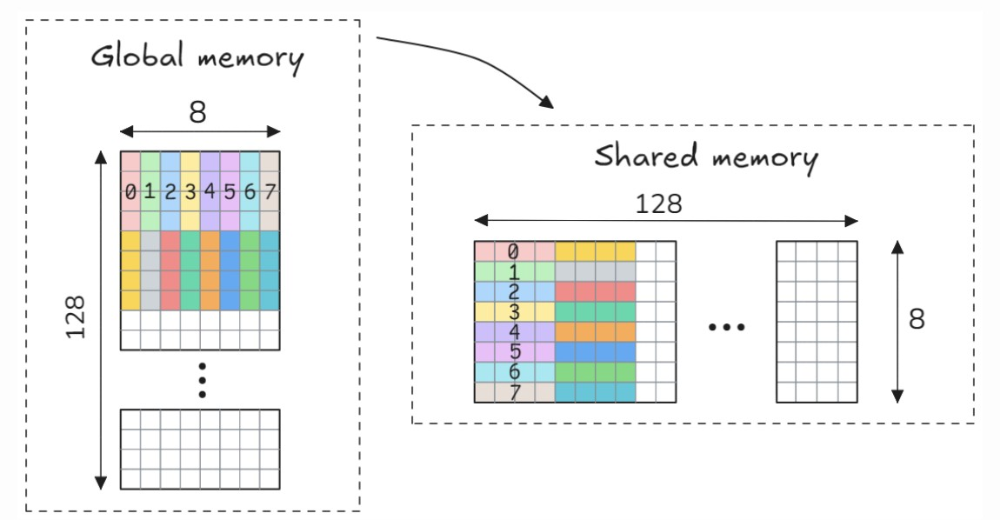
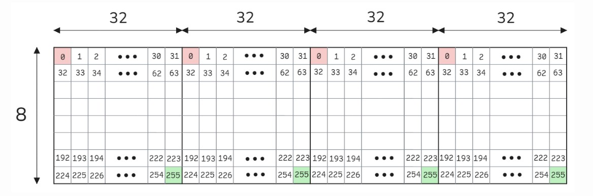
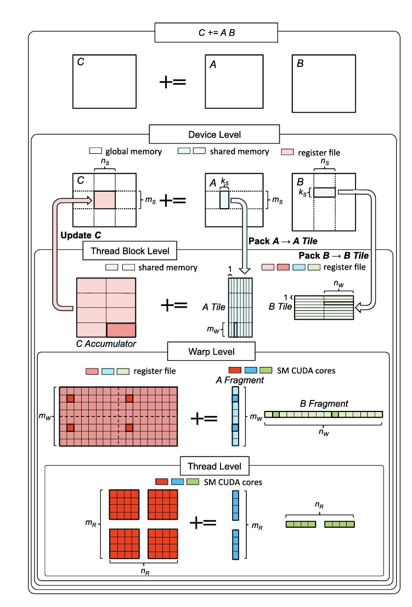
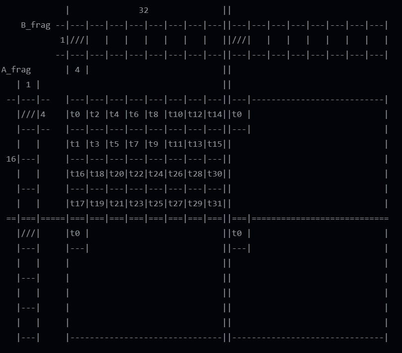
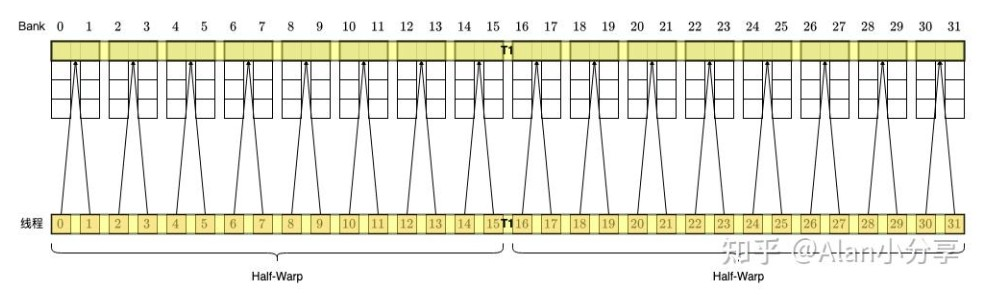
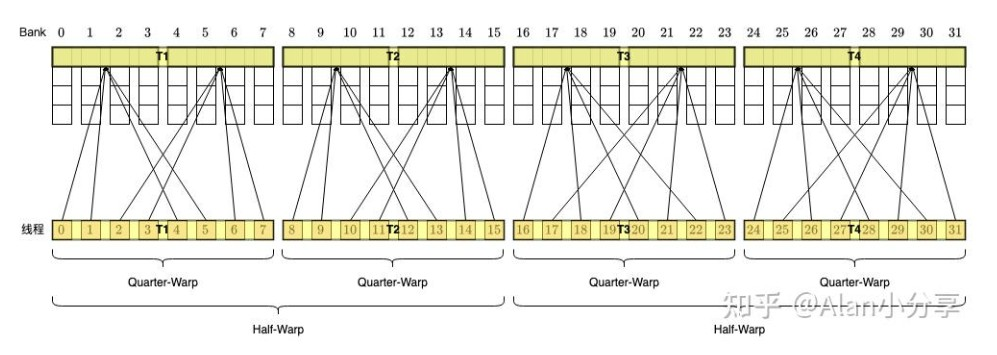

# SGEMM CUDA kernel (Second Half)

Following the previous blog, this is somewhat of a separate thread, which records my attempt to optimize the SGEMM kernel to the extreme.

I know there are many excellent engineers who have already achieved this, but to be honest, their code is often very hard to understand.

I will update this blog occasionally, as GPU is really not the focus of my work, but it still fascinates me a lot.

Again, source code can be found [here](https://github.com/twicy/CUDA).

## Table of Contents

- [Test Environment Setup](#test-environment-setup)
- [Part 8: Warp Tile (v5)](#part-8-warp-tile-v5)
  - [Nsight Analysis of the previous kernel `sgemm_v4`](#nsight-analysis-of-the-previous-kernel-sgemm_v4)
  - [Better memory access management with warp tile](#better-memory-access-management-with-warp-tile)
  - [`LDS.128` Shared Memory Transactions](#lds128-shared-memory-broadcast)
- [Part 9: Coalesced Writeback using Cs](#part-9-coalesced-writeback-using-cs)

## Test Environment Setup

After finishing grad school, I have to switch my test platform from the high end `AD102GL [RTX 6000 Ada Generation]` workstation to the cheapest Google VM I can get with `Nvidia L4` GPU

Google has a [really nice script](https://docs.cloud.google.com/compute/docs/gpus/install-drivers-gpu) that automates the installation of GPU drivers and CUDA tools.

```bash
curl -L https://storage.googleapis.com/compute-gpu-installation-us/installer/latest/cuda_installer.pyz --output cuda_installer.pyz
sudo python3 cuda_installer.pyz install_driver
reboot
sudo python3 cuda_installer.pyz install_cuda
reboot
```

## Part 8: Warp Tile (v5)

### Nsight Analysis of the previous kernel `sgemm_v4`

Using Nsight Compute, we can profile and analyze memory behavior.

```bash
sudo $(which ncu) --set full -o profile_output -f ./sgemm_v4 4096 4096 4096
ncu -i profile_output.ncu-rep > sgemm_v4.txt
```

Below is part of the profile result of `sgemm_v4`.

```text
    Section: Memory Workload Analysis Tables
    OPT   Est. Speedup: 58.32%                                                                                          
          The memory access pattern for global stores to L1TEX might not be optimal. On average, only 4.0 of the 32     
          bytes transmitted per sector are utilized by each thread. This could possibly be caused by a stride between   
          threads. Check the Source Counters section for uncoalesced global stores.                                     
    ----- --------------------------------------------------------------------------------------------------------------
    OPT   Est. Speedup: 27.27%                                                                                          
          The memory access pattern for shared loads might not be optimal and causes on average a 5.0 - way bank        
          conflict across all 134217728 shared load requests.This results in 268435456 bank conflicts,  which           
          represent 40.00% of the overall 671091703 wavefronts for shared loads. Check the Source Counters section for  
          uncoalesced shared loads.                                                                                     
    ----- --------------------------------------------------------------------------------------------------------------
    OPT   Est. Speedup: 22.72%                                                                                          
          The memory access pattern for shared stores might not be optimal and causes on average a 2.4 - way bank       
          conflict across all 20971520 shared store requests.This results in 16777216 bank conflicts,  which represent  
          33.33% of the overall 50331648 wavefronts for shared stores. Check the Source Counters section for            
          uncoalesced shared stores.              
```

There are two major problems:

- **Memory access** to global memory is **not coalesced**, wasting bandwidth. Therefore, threads within a warp should write to contiguous global memory addresses.
- **Shared memory load/store conflicts** => mostly when loading and storing back to global memory

### Better memory access management with warp tile

> Credit: The following illustrations comes mostly from [Advanced Matrix Multiplication Optimization on NVIDIA GPUs](https://salykova.github.io/sgemm-gpu), the same hierarchy was mentioned in this paper [Strassen’s Algorithm Reloaded on GPUs](https://dl.acm.org/doi/10.1145/3372419).



In `sgemm_v4`, each thread reads off a $1 \times 4$ floats (`float4`) from global memory and then stores a $4 \times 1$ to `AsT` shared memory:

```cpp
float4 a4 = FLOAT4(A[OFFSET(a_row, a_col, M, K)]);
AsT[shmem_col][shmem_row] = a4.x;
AsT[shmem_col + 1][shmem_row] = a4.y;
AsT[shmem_col + 2][shmem_row] = a4.z;
AsT[shmem_col + 3][shmem_row] = a4.w;
```

However in `sgemm_v5`, each thread reads off a $4 \times 1$ but stores $1 \times 4$ floats (`float4`) to shared memory:

```cpp
auto ld_g2r_a = [&] (int ph) {
      int col = ph * 8 + A_thread_col;
      A_ldg_reg.x = (A_row < M && col < K) ? A[OFFSET(A_row, col, K)] : 0.0f;
      A_ldg_reg.y = (A_row + 1 < M && col < K) ? A[OFFSET(A_row + 1, col, K)] : 0.0f;
      A_ldg_reg.z = (A_row + 2 < M && col < K) ? A[OFFSET(A_row + 2, col, K)] : 0.0f;
      A_ldg_reg.w = (A_row + 3 < M && col < K) ? A[OFFSET(A_row + 3, col, K)] : 0.0f;
};

auto st_r2s_a = [&] () {
      FLOAT4(AsT[A_thread_col][A_thread_row]) = A_ldg_reg;
};
```

I think both approaches need 128 memory transactions to load $128 \times 8$ floats from the global memory, because each thread loads only 8 floats (32 bytes), which does not fully utilize the 128-byte memory transaction size.

However, when it comes to storing into the shared memory, `sgemm_v5` uses vectorized store to better utilize the shared memory bandwidth, while `sgemm_v4` does not.

Bank conflict-wise (at this stage, before computation), both schemes are clean. Specifically, `sgemm_v5` intentionally inserts 4 columns to "shift" away the conflicts.


`sgemm_v5` also has a very clever memory access arrangement for B. For the most part, all memory load from global memory are obviously coalesced. When storing to shared memory, there are also no bank conflicts.



### `LDS.128` Shared Memory Transactions

> Credit: The following section relies heavily on this Zhihu Blog [搞懂 CUDA Shared Memory 上的 bank conflicts 和向量化指令（LDS.128 / float4）的访存特点](https://zhuanlan.zhihu.com/p/690052715) and [YHs_Sample sgemm](https://github.com/Yinghan-Li/YHs_Sample/blob/master/cuda/gemm/sgemm.cu).

The big picture of warp tile looks like this:



But unlike what one would expect, how threads within a warp are mapped to shared memory is not simple and trivial. `sgemm_v5` uses the following mapping.



This is because of the presence of a broadcast limitation if we simply put neighboring threads next to each other.

`LDS.32, LDS.64, LDS.128` are the PTX instructions used when threads access 32 bits (one float), 64 bits and 128 bits (four floats or `float4`) from shared memory.

#### `LDS.32`

- When multiple threads access **the same word** (32-bit) (thus of course within the same bank), the broadcast mechanism is triggered. That word is simultaneously sent to the corresponding threads.

> If all threads within a warp reads the same word, only 1 memory transaction

- When multiple threads access **different words within the same bank**, a bank conflict occurs. The request is then split into multiple memory transactions, which are issued serially for execution.

> If all threads within a warp reads totally different words in the same bank, 32 memory transactions needed.

#### `LDS.64`

Each thread requesting 2 words, thus 16 threads together saturate the 128-byte transaction size. The CUDA stack will then separate one warp (32 threads) into 2 half-warps (16 threads), leading to two memory transactions.

Only **under certain scenarios** will these **two memory transactions be merged into one**. For all active threads in a warp (where active means the thread has a memory access request):
- For thread i, thread i xor 1 is either inactive or accesses the same memory address.

> (i.e., T0 == T1, T2 == T3, T4 == T5, T6 == T7, etc.)

- For thread i, thread i xor 2 is either inactive or accesses the same memory address.

> (i.e., T0 == T2, T1 == T3, T4 == T6, T5 == T7, etc.)

Example 1: 32 threads accessing 32 consecutive `uint2`

- Does not meet the above requirements
- First half-warp will access the first 128 bytes, causing one memory transaction
- Second half-warp will trigger another

Example 2:



- T0 == T1, T2 == T3, ...
- One merged memory transaction

#### `LDS.128`

Each thread requesting 4 words, thus 8 thread along will saturate the 128 bytes of data. The CUDA stack will then separate one warp (32 threads) into 2 half-warps (16 threads), and each half-warp to 2 **quad-warps** (8 threads), **leading to up to 4 memory transactions**.

Only when the same rule applies (as the above mentioned `LDS.64`) will the group of quad-warp memory transactions be merged into one "half-warp" memory transactions, however these "half-warp" memory transactions will not further be merged into 1, meaning there will **at least be 2 memory transactions**.

Example 1: 32 threads accessing 32 consecutive `uint4`

- Does not meet the requirements
- Total of 4 quad-warp memory transactions

Example 2: Thread 15 and Thread 16 access the same `uint4`


- Does not meet either requirement
- 2 quad-warp memory transactions

Example 3: Thread 0 and Thread 15 access the same `uint4`


- Meet both requirements
- 1 merged half-warp memory transaction

Example 4: Irregular scenario



- First half-warp meets the first requirement; Second meets the second
- The requirement needs to be **coherent** across the entire warp, therefore the warp meets neither the first requirement nor the seconds
- 4 memory quad-warp transactions

#### How it associates with SGEMM kernel here

When threads are reading segments from shared memory, they are progressively reading `float4`s, and that is the "32 threads accessing 32 consecutive `uint4`" mentioned in the [above section](#lds128)

From the [previous sections](#lds128-shared-memory-broadcast), we get to see that, either we should either put

- (t0, t1), (t2, t3), ... reading the same word
- (t0, t2), (t1, t3), ... reading the same word

And that is exactly what we observed from `sgemm_v5`:

- When reading col frag from As (row frag from AsT), T0 = T2, T1 = T3, ...
- When reading row frag from Bs, T0 = T1, T2 = T3, ...

**This Z shaped mapping will make quad-warp memory transactions merged into half-warp transactions**

## Part 9: Coalesced Writeback using Cs

In `sgemm_v5`, I "shuffled" threads within the warp in a zig-zag fashion, as mentioned above, to reduce the `LDS.128` memory transactions.

`sgemm_v5` directly stores those results from per-thread registers to global memory, and since we adopt the zig-zag layout, they are no longer coalesced. Optionally, we can use shared memory as an intermediate buffer to rectify global memory access pattern.

```cpp
__shared__ __align__(16) float Cs[8][16][32];
auto st_r2g_c = [&] () {
      #pragma unroll
      for (int i = 0; i < 2; i++) {
            #pragma unroll
            for (int j = 0; j < 2; j++) {
                  #pragma unroll
                  for (int row = 0; row < 4; row++) {
                        FLOAT4(Cs[warpId][frag_row * 4 + row][frag_col * 4]) = FLOAT4(acc[4 * i + row][4 * j]);
                  }
                  __syncwarp();

                  const int c_col = block_col + warp_col + j * 32 + laneId;
                  
                  #pragma unroll
                  for (int p = 0; p < 16; p++) {
                        const int c_row = block_row + warp_row + i * 16 + p;
                        if (c_row < M && c_col < N) {
                              C[OFFSET(c_row, c_col, N)] = Cs[warpId][p][laneId];
                        }
                  }
                  
                  __syncwarp();
            }
      }
};
```

Each warp writes into its `[16][36]` intermediate buffer, and then we flush the 16 rows one by one. Note that `__syncwarp()` instead of `__syncthreads()` is used, because each warp independently works on its own `Cs[warpId]` array, we only need threads within a warp to synchronize.

There is an obvious tradeoff to make here, as in `sgemm_v6` we have more synchronizations but our store to the global memory is coalesced.

On the `Nvidia L4` GPU I am using, this actually hurts the performance a little bit.

## Future Works

1. Have more illustrations
2. Consider bank conflict of registers
3. Double buffering
4. PTX analysis and so on

## References

- [Strassen’s Algorithm Reloaded on GPUs](https://dl.acm.org/doi/10.1145/3372419)
- [Advanced Matrix Multiplication Optimization on NVIDIA GPUs](https://salykova.github.io/sgemm-gpu)
- [Inline PTX Assembly in CUDA](https://docs.nvidia.com/cuda/inline-ptx-assembly/index.html)
- [搞懂 CUDA Shared Memory 上的 bank conflicts 和向量化指令（LDS.128 / float4）的访存特点](https://zhuanlan.zhihu.com/p/690052715)
- [YHs_Sample sgemm](https://github.com/Yinghan-Li/YHs_Sample/blob/master/cuda/gemm/sgemm.cu)