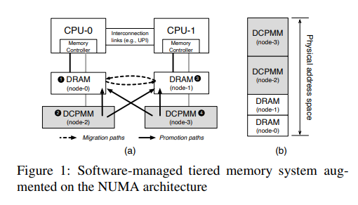

Exploring the Design Space of Page Management for Multi-Tiered Memory Systems

# Background
- Large Memory Systems
Scaling DRAM density is a big challenge;

SCM is byte-addressable and non-volatile, but it can't bridge the performance gap between DRAM and SSD.

This paper uses Intel DCPMM; 

mode1: hardware-assisted; DRAM as cache and DCPMM as the main memory

mode2: software-assisted; Full exposure to DRAM and DCPMM, OS supported

- Performance Characteristics

In multi-tiered memory systems, the critical factors in performance are not only the access locality but also the access tier of memory.

- OS Support of Multi-Tiered Memory

current Linux relies on NUMA framework

a) Linux classifies local/remote in binary; promoting/migrating pages does not consider serveral other remote nodes
b) Linux does not support demoting (or reclaiming) pages from the upper-tier to the lower-tier memory

# Major Contributions

# Design
