# Volunteering

Time flies. It is hard to believe that six years have passed since I left the simple and peaceful village of Sanhe. Looking back, volunteering as a teacher there was one of the most meaningful and rewarding experiences of my life.

## Part 1: Sanhe at First Sight

Sanhe is, in many ways, a very typical third-tier town in China.

> Countryside pavement

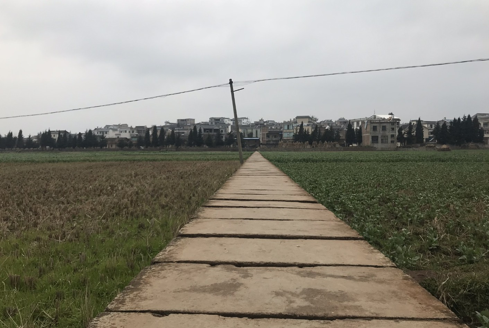

> Village

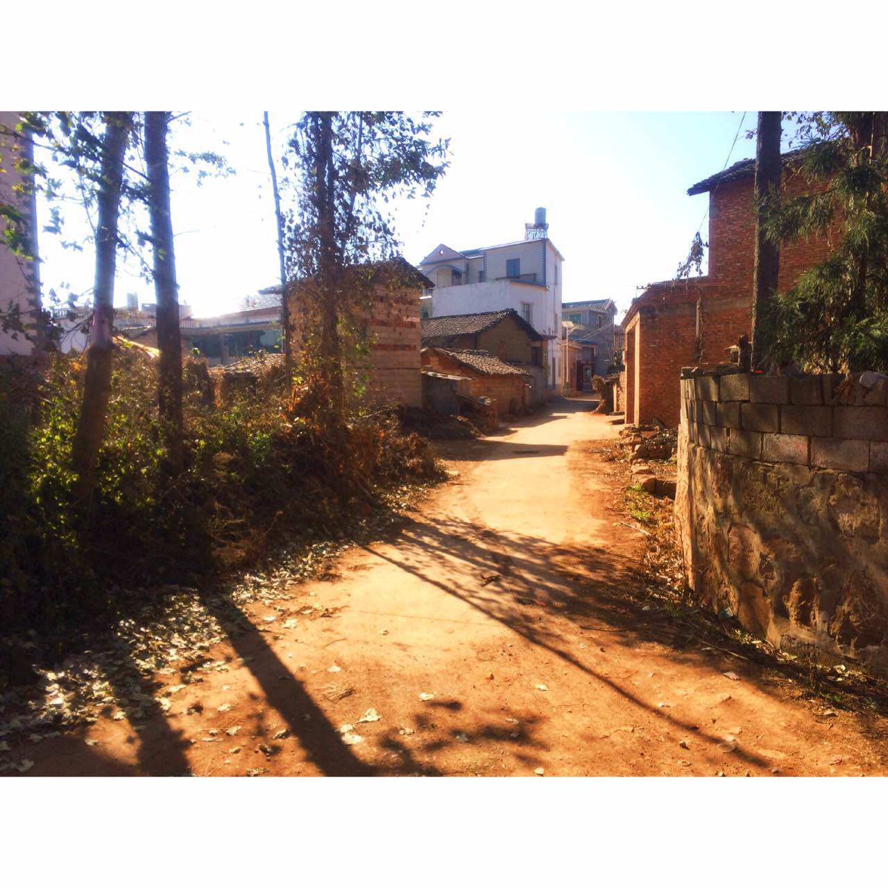
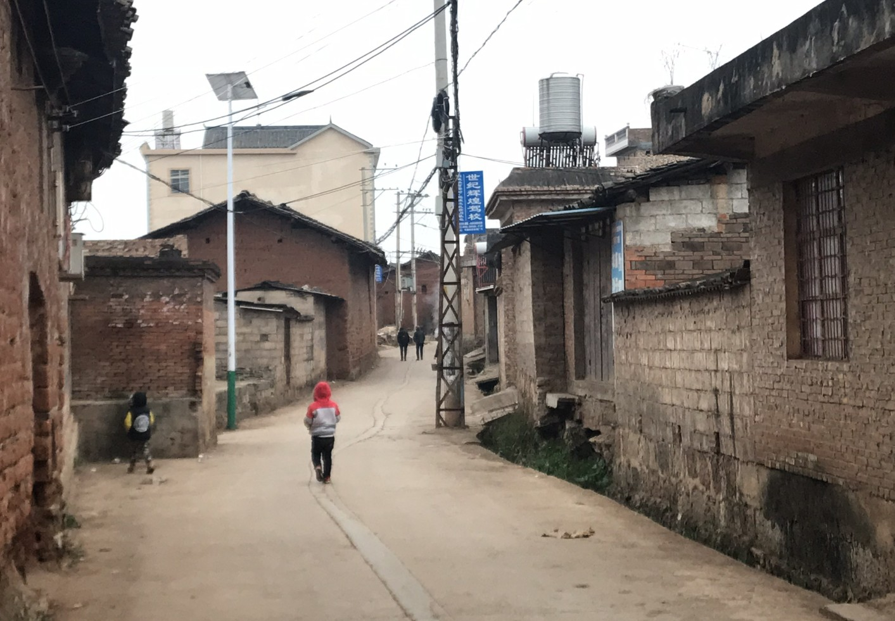

> One of the main exits leading to neighboring villages

> Coal-based heater

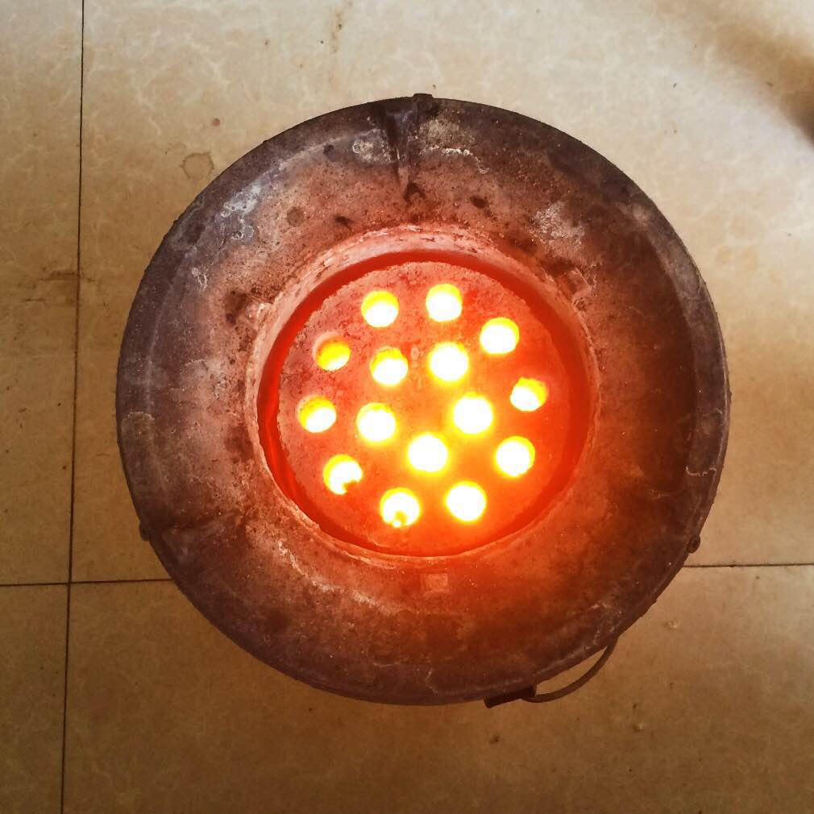

I used the exact same type of heater when I was little. Over time, these heaters were gradually phased out due to safety concerns—most notably carbon monoxide poisoning.

**Nostalgia** was my very first impression of Sanhe. While the outside world spins faster than ever—sometimes only tens of miles away—time here feels frozen. Outsiders might see this as a rare gift, but for many locals, it feels more like a curse.

> A nearby city, not far from Sanhe

## Part 2: Life as a Student in Sanhe

Students here live under an extremely tight schedule: waking up at 6:00 a.m., going to bed at 10:20 p.m., attending 11 classes a day, interleaved with meals, physical exercise, classroom cleaning, and self-study.

> Ping pong is very popular here

> A daily schedule spanning from 6:00 a.m. to 10:20 p.m.

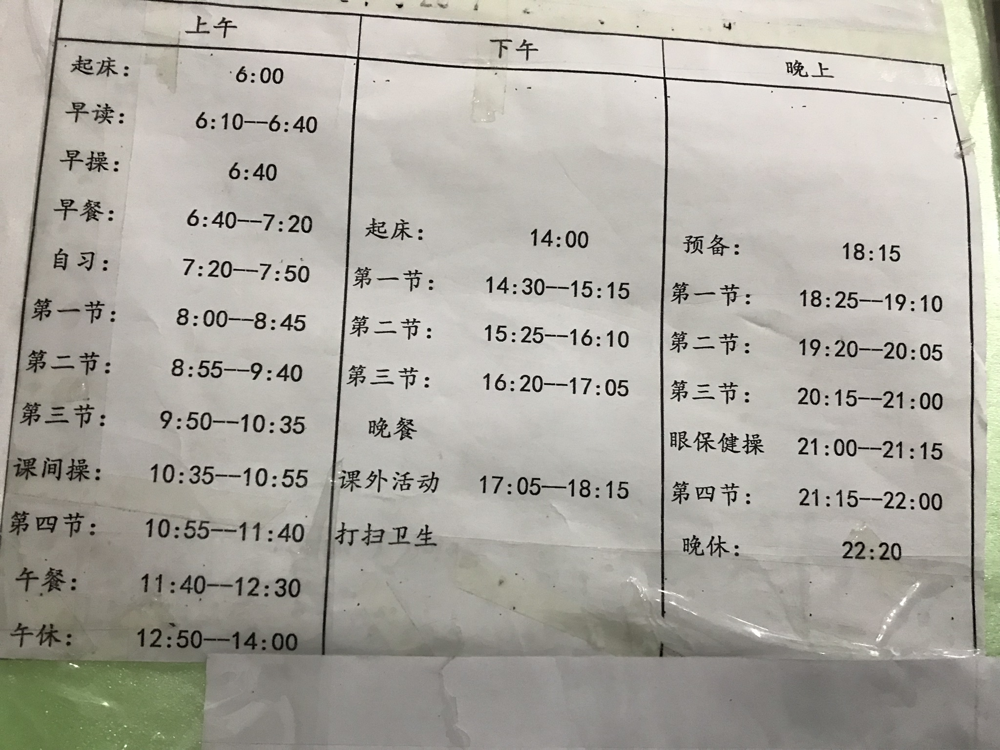

I firmly believe that excessive study hours merely **overfit** students to an ocean of test questions and do not necessarily translate into better learning outcomes. I often observed students memorizing definitions of simple concepts, which revealed a deeper issue: they were memorizing without truly understanding—hardcoding instead of comprehending.

On top of this, these students face challenges many others could hardly imagine. In a composition titled *“A Terrible Day,”* one student wrote:

> “I am alone all the time, even during festivals… Every day, I run upstairs, look toward the mountains, and cannot help but cry.”  
>  
> “I really want to yell out loud—why does this unfortunate separation have to happen to my family? What a great holiday it would be if I could reunite with my family and have dinner together.”

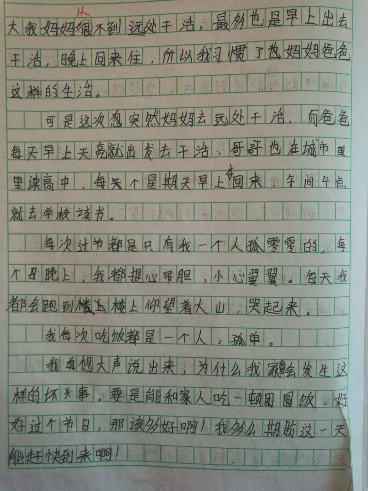

For students here, living apart from parents—often staying with grandparents instead—is extremely common. Most parents work far away from town, leaving behind their children and elderly family members in the small, quiet village of Sanhe.

**Solitude** is the dominant theme in almost every student’s life, something I gradually realized after teaching for a few weeks.

## Part 3: Teaching in Sanhe

Teaching in Sanhe was deeply rewarding. There were no fancy decorations or modern teaching equipment, but the students were bright and sincere. After a week or two, they would slowly open their hearts, treat you as a friend, and sometimes even share their secrets.

> School building

I taught mathematics, and my responsibilities included giving lectures, grading assignments, and preparing exams. One experience stands out clearly in my memory.

There was a particular math concept—**non-negative integers vs. positive integers**—that I emphasized repeatedly. I explained it in multiple ways, practiced it extensively with the class, and even told them explicitly that it would almost certainly appear on the exam. Yet when the results came back, many students had made the exact same mistake.

Instead of lecturing them immediately, I did something unusual. I gathered all the students who made that mistake and took a group photo with them. I told them calmly: *After the next exam, I’ll check again. If you make the same mistake, only then will we talk.*

> The group photo

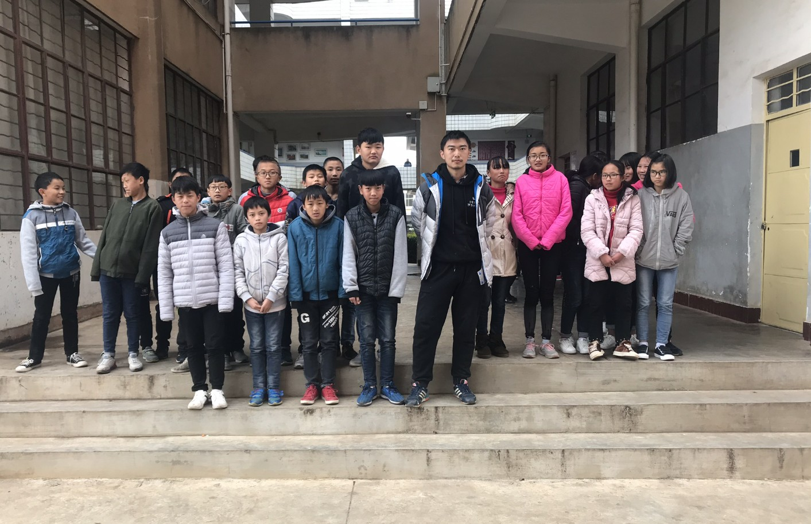

At the time, I was admittedly disappointed and surprised. The real-time responses I received in class felt genuinely positive, yet the exam results told a very different story. Eventually, I realized the reason: many students were simply too shy to ask questions, and their long-standing habit of memorization over understanding was hard to break.

Of course, I never intended to “punish” them in any sense. After class, we were genuinely friends.

> Boys

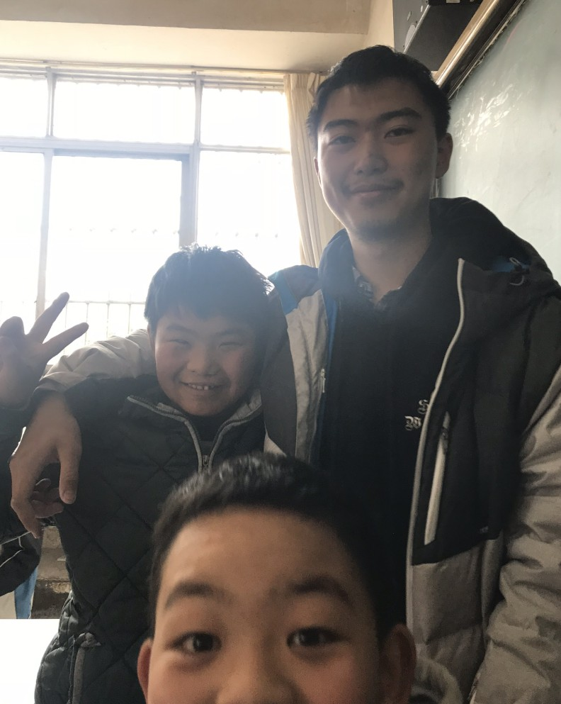

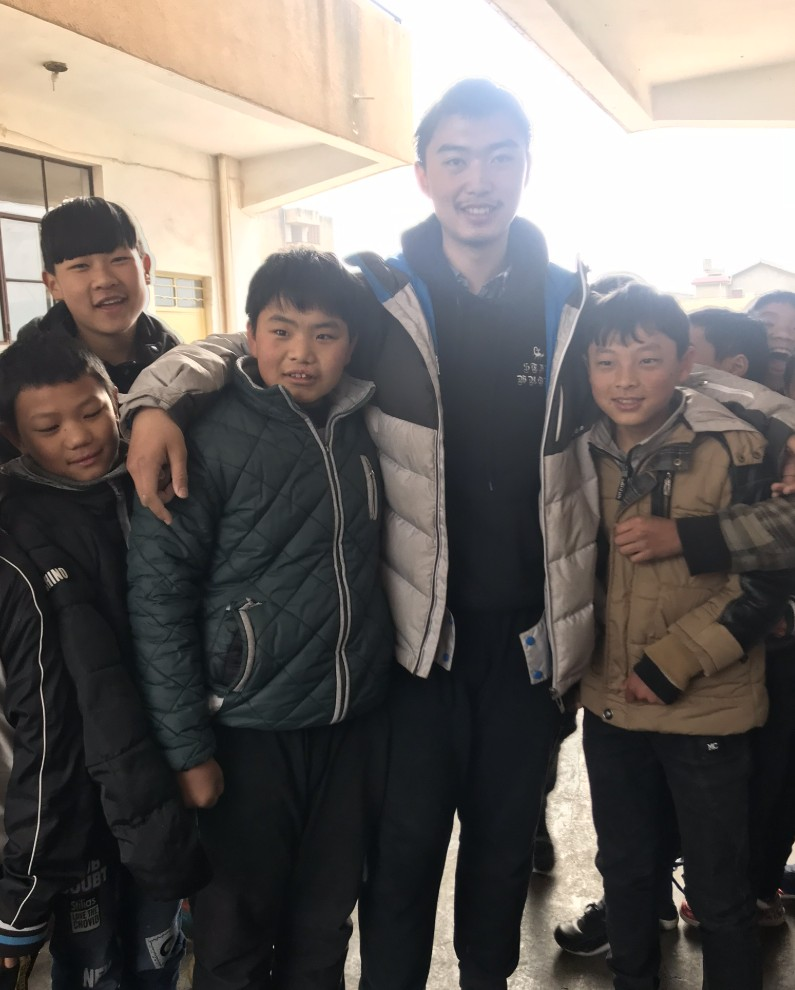

> One of my favorite students

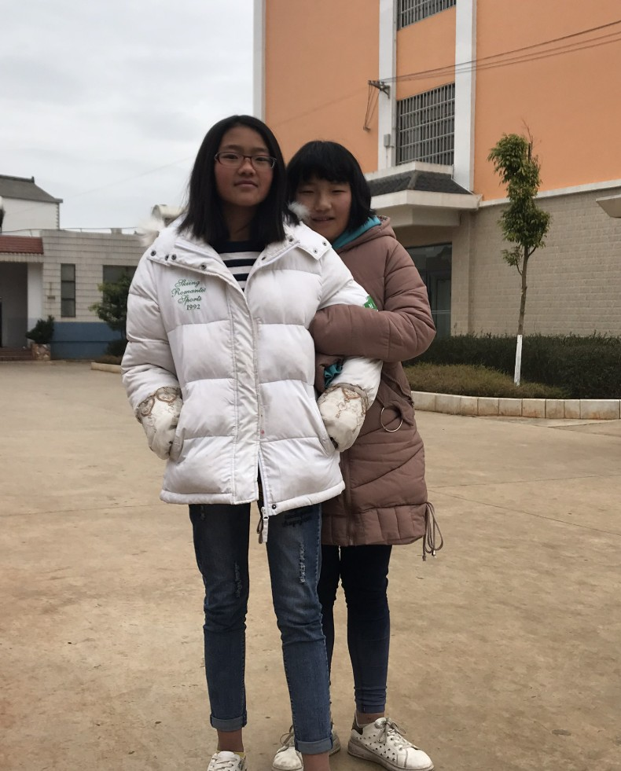

Beyond regular classes, we also organized [special events](https://mp.weixin.qq.com/s/IXSu34ytvlrgjP0NT40CgQ), including rugby, football, and Chinese dialect lessons. In one class, we asked students to write down their dreams. A student from a higher grade wrote:

> “Four years later, I will be somewhere on Earth. I wish I could be the best of the best, though I know it sounds unrealistic for someone like me, who comes from a rural area.  
>  
> I once dreamed of becoming a doctor, but now all I want is to be admitted into a good university and find a decent job, so I can stay with my parents every day. As someone who only sees them once a year, there is probably no better wish.”

## Part 4: Leaving Sanhe

> Class 209, which I taught

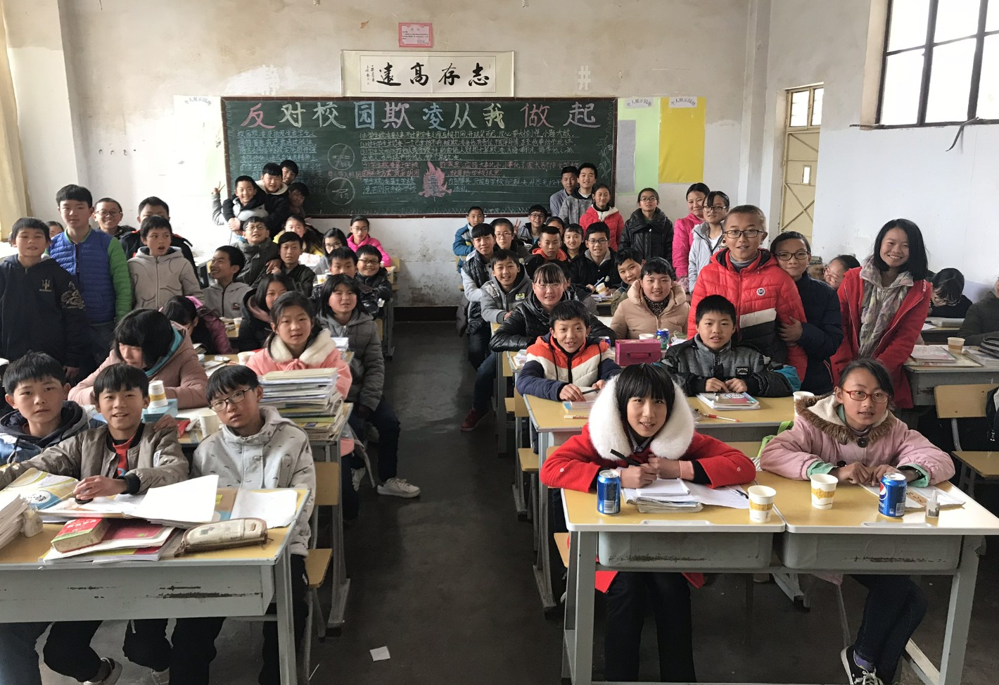

> Path toward a brighter future

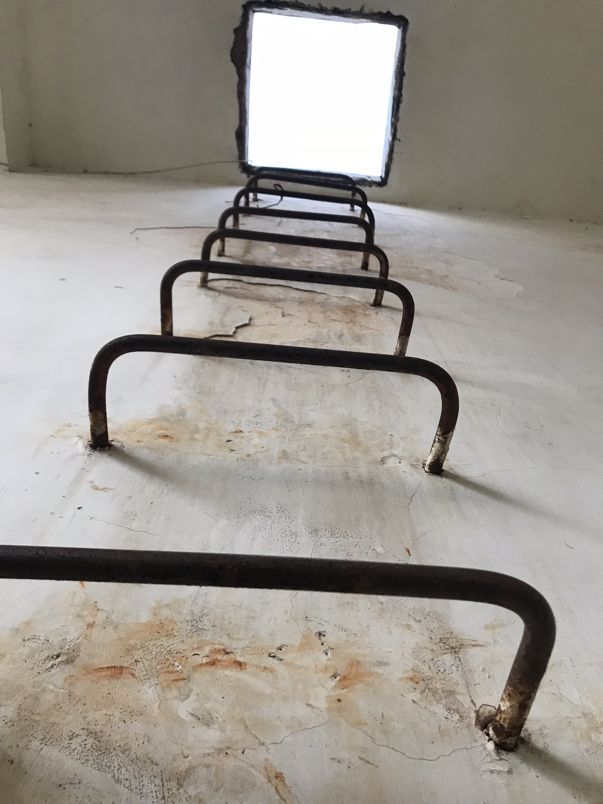

> The moon we share

Returning from Sanhe changed how I view my own life. I became far more conscious of what I have and far less tolerant of wasting time and resources. When I think about not only the hardships these students face, but also the perseverance and courage they demonstrated every day, it becomes impossible not to feel humbled.

Sanhe was a small place, but it left an enduring mark on me.
